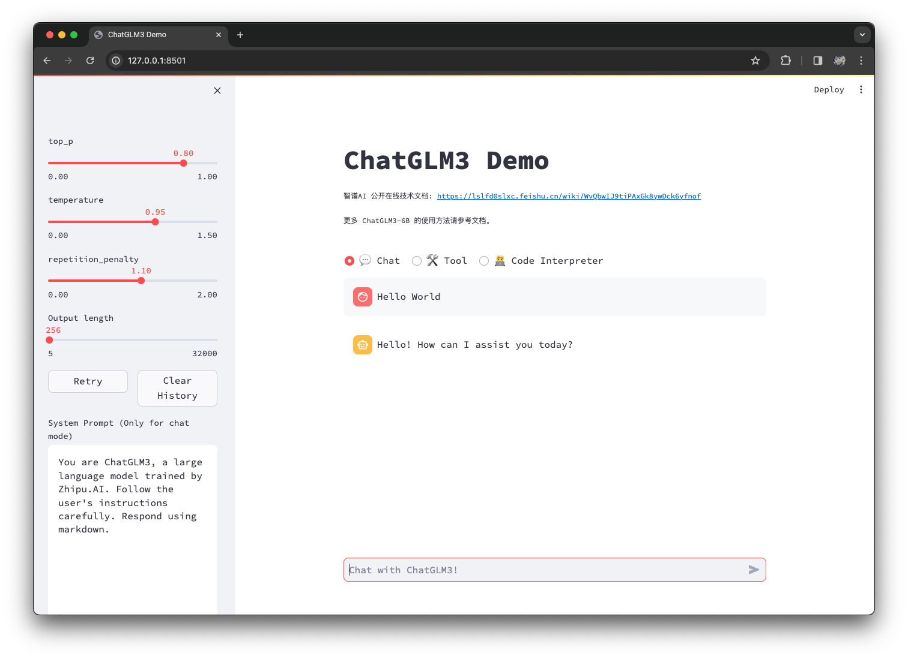

# ChatGLM3-6B
## 概述
&emsp;&emsp;ChatGLM3-6B 是 ChatGLM 系列第三代的开源模型，在保留了前两代模型对话流畅、部署门槛低等众多优秀特性的基础上，ChatGLM3-6B 引入了如下特性：

1. **更强大的基础模型：** ChatGLM3-6B 的基础模型 ChatGLM3-6B-Base 采用了更多样的训练数据、更充分的训练步数和更合理的训练策略。在语义、数学、推理、代码、知识等不同角度的数据集上测评显示，ChatGLM3-6B-Base 具有在 10B 以下的预训练模型中最强的性能。
2. **更完整的功能支持：** ChatGLM3-6B 采用了全新设计的 Prompt 格式，除正常的多轮对话外。同时原生支持工具调用（Function Call）、代码执行（Code Interpreter）和 Agent 任务等复杂场景。
3. **更全面的开源序列：** 除了对话模型 ChatGLM3-6B 外，还开源了基础模型 ChatGLM-6B-Base、长文本对话模型 ChatGLM3-6B-32K。以上所有权重对学术研究完全开放，在填写问卷进行登记后亦允许免费商业使用。

## 参考链接

- Hugging Face[[链接](https://huggingface.co/THUDM/chatglm3-6b)]
- GitHub[[链接](https://github.com/THUDM/ChatGLM3)]

## 环境

- Ubuntu 22.04.3
- CUDA 12.3.2
- GPU NVIDIA RTX 4090
- Anaconda3

::: tip 提示
&emsp;&emsp;搭建环境的过程中，需要下载很多内容，包括 Python 依赖、ChatGLM3-6B 模型等，建议在`网络较好`的环境下搭建。
:::

## 安装
```bash
# 创建一个 conda 环境并安装所需依赖
# ChatGLM3-6B 需要 Python 3.10 或更高版本
$ conda create -n chatglm3 python=3.10
$ conda activate chatglm3

# 拉取 ChatGLM3-6B 仓库
$ git clone https://github.com/THUDM/ChatGLM3

$ cd ChatGLM3

# 安装项目依赖
$ pip install -r requirements.txt
```

## 运行
### 运行 Web Demo

```bash
# 进入 composite_demo 目录
$ cd composite_demo

# 安装依赖
$ pip install -r requirements.txt

# 运行
$ streamlit run main.py
```



## 补充说明
### 从本地加载模型
&emsp;&emsp;在运行 Web Demo 时，`transformers` 会自动下载模型实现和参数。可以将模型下载到本地，然后从本地加载

```bash
$ git clone https://huggingface.co/THUDM/chatglm3-6b
```

::: tip 提示
&emsp;&emsp;注意，克隆 HuggingFace 模型仓库时，需要提前安装 `git lfs`。如果未安装，可以参考文档[[链接](https://docs.github.com/zh/repositories/working-with-files/managing-large-files/installing-git-large-file-storage)]完成安装过程。
:::