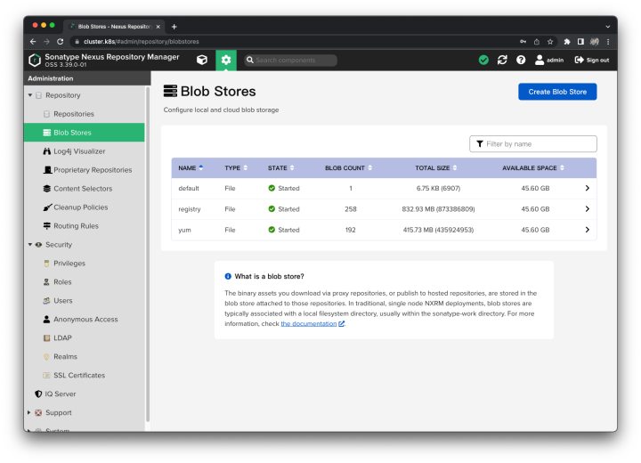
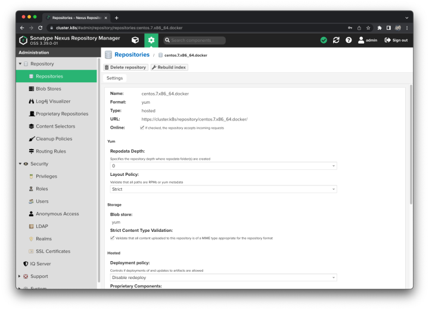
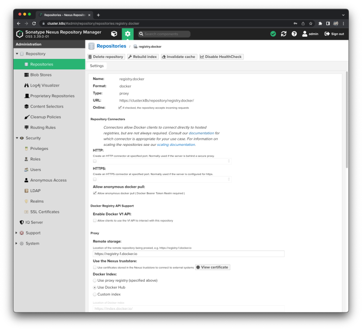
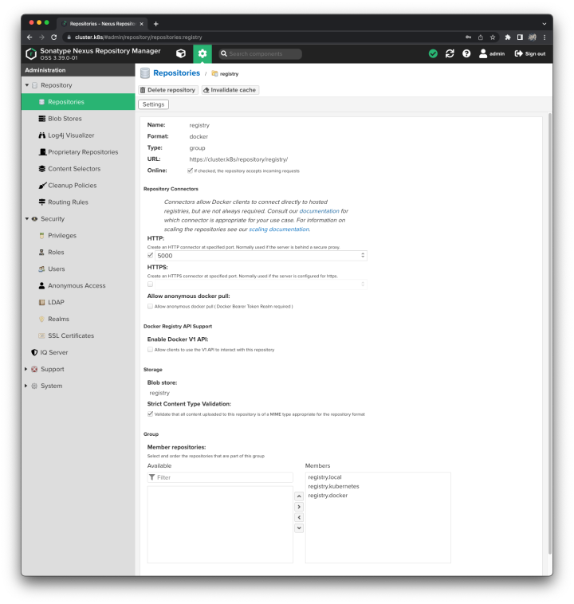
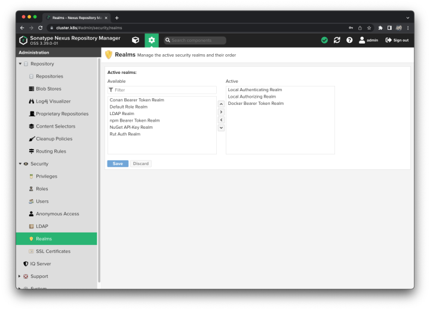

# 搭建 Nexus3
## 概述
&emsp;&emsp;在之前搭建 Kubernetes 离线环境[[链接](/blogs/k8s/setup-offline)]的时候，利用 createrepo 和 nginx 搭建了 yum 私库，利用 registry 和 nginx 搭建了 docker 私库，解决了在无网环境下更新 CentOS 7 系统和安装 Kubernetes 环境的问题。但是这种方案始终还是太过麻烦了，后面找了一下，发现 Nexus3 不仅支持当作 maven 私库来使用，还可以当成 yum 私库、registry 私库、apt 私库、npm 私库等等。

&emsp;&emsp;在日常使用的过程中，还是这类带可视化界面的系统更方便些，因此写一篇笔记记录一下使用 Docker 搭建 Nexus3 的过程。

## 步骤
### 搭建 docker、docker-compose 环境
&emsp;&emsp;可以参考我另写的一篇笔记[[链接](/blogs/docker/setup)]，这里不再赘述。

### 搭建过程
&emsp;&emsp;创建以下目录：

```
svc
 ├── docker-compose.yml
 ├── svc-nexus # 这个目录注意需要通过 chmod 733 的方式修改目录的写入权限，否则 Nexus 会初始化失败
 └── svc-nginx
     └── conf.d
         ├── nexus.conf
         └── ssl # SSL 证书信息
             ├── cluster.k8s.pem
             └── cluster.k8s.key
```

&emsp;&emsp;修改 docker-compose.yml 文件，文件内容如下：

```yaml
version: "3"

services:
  # 用于为 Nexus 提供域名访问、SSL 访问等
  svc-nginx:
    image: nginx:1.22.0
    container_name: svc-nginx
    volumes:
      - ./svc-nginx/conf.d:/etc/nginx/conf.d
      - ./svc-nginx/logs:/var/log/nginx
    ports:
      - "80:80"
      - "443:443"
    restart: always
    networks:
      - default
  # Nexus
  svc-nexus:
    image: sonatype/nexus3:3.39.0
    container_name: svc-nexus
    volumes:
      - ./svc-nexus:/nexus-data
    restart: always
    networks:
      - default

# Networks
networks:
  default:
    driver: bridge
    name: svc
```

&emsp;&emsp;修改 nginx.conf 文件，文件内容如下：

```nginx
# 将 http 请求重定向到 https 地址
server {
    listen 80;
    server_name cluster.k8s mirror.cluster.k8s registry.cluster.k8s;
    rewrite ^(.*)$ https://$host$1 permanent;
}

server {
    listen 443 ssl;
    server_name cluster.k8s;
    ssl_certificate     /etc/nginx/conf.d/ssl/cluster.k8s.pem;
    ssl_certificate_key /etc/nginx/conf.d/ssl/cluster.k8s.key;

    # Nexus 的管理界面入口
    location / {
        proxy_pass http://svc-nexus:8081;
        proxy_redirect default;
        client_max_body_size 1000m;

        proxy_set_header X-Forwarded-Host $http_host;
        proxy_set_header X-Forwarded-For $proxy_add_x_forwarded_for;
        proxy_set_header X-Forwarded-Proto $scheme;
        proxy_set_header X-Forwarded-Port $server_port;
    }
}

# 镜像加速地址
server {
    listen 443 ssl;
    server_name mirror.cluster.k8s;
    ssl_certificate     /etc/nginx/conf.d/ssl/cluster.k8s.pem;
    ssl_certificate_key /etc/nginx/conf.d/ssl/cluster.k8s.key;

    location / {
        proxy_pass http://svc-nexus:5000;
        proxy_redirect default;
        client_max_body_size 1000m;

        proxy_set_header X-Forwarded-Host $http_host;
        proxy_set_header X-Forwarded-For $proxy_add_x_forwarded_for;
        proxy_set_header X-Forwarded-Proto $scheme;
        proxy_set_header X-Forwarded-Port $server_port;
    }
}

# 本地镜像的上传入口
server {
    listen 443 ssl;
    server_name registry.cluster.k8s;
    ssl_certificate     /etc/nginx/conf.d/ssl/cluster.k8s.pem;
    ssl_certificate_key /etc/nginx/conf.d/ssl/cluster.k8s.key;

    location / {
        proxy_pass http://svc-nexus:5002;
        proxy_redirect default;
        client_max_body_size 1000m;

        proxy_set_header X-Forwarded-Host $http_host;
        proxy_set_header X-Forwarded-For $proxy_add_x_forwarded_for;
        proxy_set_header X-Forwarded-Proto $scheme;
        proxy_set_header X-Forwarded-Port $server_port;
    }
}
```

&emsp;&emsp;使用以下命令启动环境：

```bash
$ docker-compose up -d

# 查看是否启动成功
$ docker ps
```

## 管理过程
&emsp;&emsp;Docker 启动完毕之后，就可以通过 https://cluster.k8s （我这边使用了自建 DNS，可以参考我另一篇笔记[[链接](/blogs/docker/dns)]）访问刚刚搭建的 Nexus 系统了。

&emsp;&emsp;点击右上角的 Sign in，准备登录系统。Nexus3 的默用管理员帐号是 admin，密码可以在 svc/svc-nexus/admin.password 文件里找到。登录上去之后，会引导你修改密码。修改完了之后，admin.password 文件会消失。

### 创建存储仓库
&emsp;&emsp;在 Blob Stores 页面，点击右上方的 Create Blob Store，分别创建 registry、yum 这两个 File 类型的存储仓库。



### 管理 yum 私库
&emsp;&emsp;在 Repositories 页面，点击左上方的 Create repository，选择 yum (hosted)，分别创建以下仓库：

- centos.7.x86_64.docker：Docker Yum 源
- centos.7.x86_64.elrepo：内核 Yum 源
- centos.7.x86_64.elrepo-extras：内核 Yum 源
- centos.7.x86_64.elrepo-kernel：内核 Yum 源
- centos.7.x86_64.kubernetes：Kubernetes 源
- centos.7.x86_64.nginx：Nginx 源
- centos.7.x86_64.extras：CentOS 源
- centos.7.x86_64.os：CentOS 源
- centos.7.x86_64.updates：CentOS 源

&emsp;&emsp;这些仓库的配置都是一样的，如下图所示：



&emsp;&emsp;完成了 Yum 源的仓库之后，就可以将下载分类好的 rpm 包上传到对应的私库了。Nexus3 提供了通过可视化界面上传 rpm 包的功能，但是由于需要上传的包太多了，我写了个 Shell 脚本来上传这些 rpm 包。

```shell
workingDir=$(pwd)

for rpm in `ls $1*.rpm`
do
    # 将 --user 后面的参数修改为当前仓库的帐号密码
    # 将后面的地址修改为 nexus 仓库的访问地址
    result=`curl -v --user 'admin:123456' --upload-file $workingDir/$rpm https://cluster.k8s/repository/centos.7.x86_64.docker/$rpm`
    echo "$result: $rpm"
done
```

&emsp;&emsp;完成 rpm 包的上传之后，私有 Yum 源就搭建完成了。在使用时，需要将系统原来的 yum 源删除了，并添加私有 yum 源，然后就可以像正常联网的方式一样安装和更新系统了。

```
# 删除系统自带的 yum 源
$ rm -f /etc/yum.repos.d/CentOS-*

# 添加私有 yum 源
$ nano /etc/yum.repos.d/centos.repo

# 以下是 /etc/yum.repos.d/centos.repo 的文件内容
[base]
name=CentOS-$releasever - Base
failovermethod=priority
baseurl=https://cluster.k8s/repository/centos.$releasever.$basearch.os/
enabled=1
gpgcheck=0

[updates]
name=CentOS-$releasever - Updates
failovermethod=priority
baseurl=https://cluster.k8s/repository/centos.$releasever.$basearch.updates/
enabled=1
gpgcheck=0

[extras]
name=CentOS-$releasever - Extras
failovermethod=priority
baseurl=https://cluster.k8s/repository/centos.$releasever.$basearch.extras/
enabled=1
gpgcheck=0


# EPEL (Extra Packages for Enterprise Linux), 是由 Fedora Special Interest Group 维护的 Enterprise Linux（RHEL、CentOS）中经常用到的包。
[elrepo]
name=ELRepo.org Community Enterprise Linux Repository - el7
baseurl=https://cluster.k8s/repository/centos.$releasever.$basearch.elrepo/
enabled=1
gpgcheck=0

[elrepo-kernel]
name=ELRepo.org Community Enterprise Linux Kernel Repository - el7
baseurl=https://cluster.k8s/repository/centos.$releasever.$basearch.elrepo-kernel/
enabled=0
gpgcheck=0

[elrepo-extras]
name=ELRepo.org Community Enterprise Linux Extras Repository - el7
baseurl=https://cluster.k8s/repository/centos.$releasever.$basearch.elrepo-extras/
enabled=0
gpgcheck=0

# Nginx 源
[nginx]
name=nginx repo
baseurl=https://cluster.k8s/repository/centos.$releasever.$basearch.nginx/
enabled=1
gpgcheck=0

# Docker 源
[docker]
name=Docker CE Stable - $basearch
baseurl=https://cluster.k8s/repository/centos.$releasever.$basearch.docker/
enabled=1
gpgcheck=0

# Kubernetes 源
[kubernetes]
name=Kubernetes
baseurl=https://cluster.k8s/repository/centos.$releasever.$basearch.kubernetes/
enabled=1
gpgcheck=0
```

### 管理 docker 私库
&emsp;&emsp;在 Repositories 页面，点击左上方的 Create repository，选择 docker (hosted)，用于托管自己构建的 Docker 镜像。其配置如下：


&emsp;&emsp;然后再创建一个 docker（proxy）类型的仓库，用于作为 Docker 中央仓库的加速镜像仓库。其配置如下（没截出来的按默认的配置就好）：



&emsp;&emsp;最后，再创建一个 docker (group) 类型的仓库，用于将多个仓库合并成一个外部访问地址。其配置如下：



&emsp;&emsp;需要注意，这里创建 registry.local 仓库时，使用了 5002 端口；创建 registry 仓库时，使用了 5000 端口，需要和 Nginx 的配置匹配上，否则将无法访问。

&emsp;&emsp;最后，打开 Security/Realms 页面，将 Docker Bearer Token Realm 从左边添加到右边，用于启用 Docker 登录认证。



&emsp;&emsp;完成以上步骤之后，就可以使用 Docker 私库了。

```bash
# 测试是否可以访问私库
# 如果报证书错误，那么请参考我另一篇笔记解决该问题 https://central-x.com/blogs/linux/ssl
$ curl https://cluster.k8s/v2/
{}

# 登录私库
# 后续就可以通过 registry.cluster.k8s/xx 的方式将镜像上传到私库了
$ docker login registry.cluster.k8s
username: admin
password: 123456

Authenticating with existing credentials...
Login Succeeded

# 拉取镜像
# Nexus 会从 Docker 中央库里面拉取并转发，后面再拉取的时候，就直接从本地拉取了
$ docker pull mirror.cluster.k8s/nginx:1.22.0
```

&emsp;&emsp;配置 Containerd 的时候，就可以将镜像仓库设为 cluster.k8s 了。

```bash
$ nano /etc/containerd/config.toml


      [plugins."io.containerd.grpc.v1.cri".registry.configs]
        [plugins."io.containerd.grpc.v1.cri".registry.configs."mirror.cluster.k8s".tls]
          ca_file = "/etc/ssl/certs/root.crt"
#        [plugins."io.containerd.grpc.v1.cri".registry.configs."cluster.k8s".auth]
#          username = "test"
#          password = "test"

      [plugins."io.containerd.grpc.v1.cri".registry.mirrors]
        [plugins."io.containerd.grpc.v1.cri".registry.mirrors."docker.io"]
          endpoint = ["https://mirror.cluster.k8s"]
        [plugins."io.containerd.grpc.v1.cri".registry.mirrors."k8s.gcr.io"]
          endpoint = ["https://mirror.cluster.k8s"]
        [plugins."io.containerd.grpc.v1.cri".registry.mirrors."cluster.k8s"]
          endpoint = ["https://mirror.cluster.k8s"]
```