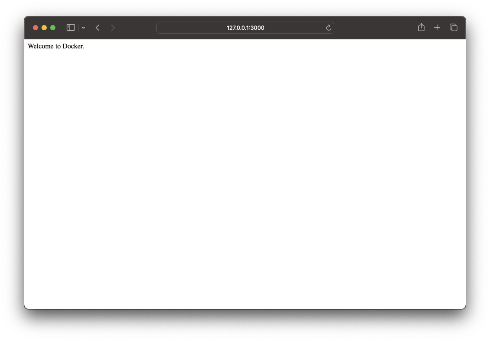

# 入门
## 概述
&emsp;&emsp;Docker 是一个开源的应用容器引擎，用于运行标准化容器。除了 Docker 外，市面上还有 podman、containerd 等应用容器引擎。

&emsp;&emsp;容器是一种轻量级的虚拟化技术，它将应用的运行环境、应用程序等打包起来，以一个整体的方式对外分发，这样就保证了应用程序不会因为运行环境的变化而产生不可控的负面影响。

&emsp;&emsp;接下来从镜像如何产生，到如何运行镜像进行一个简单的入门体验。

## 镜像
### Dockerfile
&emsp;&emsp;Dockerfile 用于描述镜像的构建过程。我们来看看一个简单的 Dockerfile 示例：

```dockerfile
# 指定本镜像的基础镜像
FROM nginx:1.25.3

# 添加静态文件指镜像中
ADD ./html.tar.gz /usr/share/nginx

# 指定镜像暴露的端口号
EXPOSE 80

# 镜像的启动命令
CMD ["nginx", "-g", "daemon off;"]
```

> 关于更多 Dockerfile 的内容，可以参考另一篇文档[[链接](/blogs/docker/dockerfile)]。

### 编译

&emsp;&emsp;将上面的 Dockerfile 内容保存下来，同时将示例中用到的 html.tar.gz 文件[[链接](./assets/html.tar.gz)]保存到同一个目录里。目录结构如下：

```
html
 ├── Dockerfile
 └── html.tar.gz
```

&emsp;&emsp;在 html 目录下，执行 `docker build` 命令，完成镜像的编译：

```bash
# -t: 为生成出来的镜像添加名字
$ docker build -t html:latest .
```

&emsp;&emsp;通过 `docker images` 命令可以发现本地镜像中新增了一个镜像：

```bash
$ docker images             
REPOSITORY         TAG            IMAGE ID       CREATED          SIZE
html               latest         c921344ba86a   1 minutes ago    192MB
```

## 运行

&emsp;&emsp;通过 `docker run` 命令可以将镜像运行起来：

```bash
# 运行 html:latest 镜像，并将本的地 3000 端口与镜像的 80 端口绑定起来
$ docker run -p 3000:80 html:latest
```

&emsp;&emsp;通过浏览器，我们就可以发现，Docker 镜像已经运行起来了。

