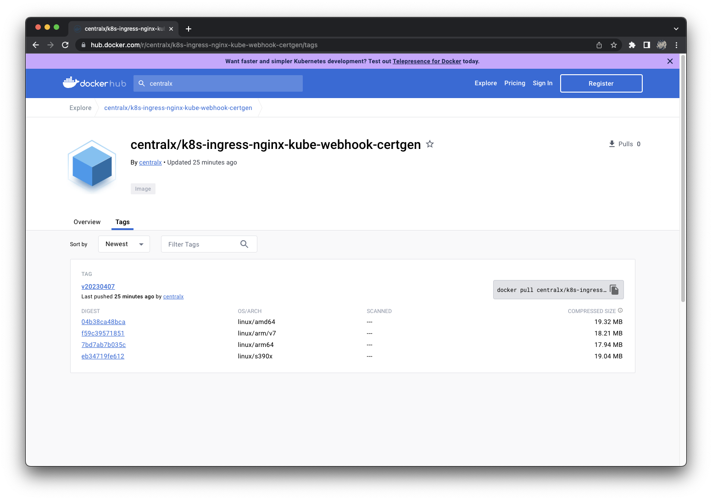

# 代理下载镜像
## 概述
&emsp;&emsp;在搭建 Kubernetes 环境的过程中，需要下载很多官方镜像。Kubernetes 在 1.27 发布之后，宣布原来的 k8s.gcr.io 镜像仓库弃用，新版本全面切换到 registry.k8s.io 镜像仓库。新的 registry.k8s.io 镜像仓库启用了 CDN 技术，会根据你所在的位置返回最近的 CDN 地址，加速镜像拉取速度。

&emsp;&emsp;然而国内的网络还是没办法享受这些福利，这些 CDN 还是没办法访问。为了顺利搭建 Kubernetes 环境，只能开发者自行想办法去提前下载这些镜像，并上传自己搭建的私服来解决镜像问题了。

&emsp;&emsp;目前，可以通过阿里云提供的镜像仓库 `registry.cn-hangzhou.aliyuncs.com/google_containers` 来下载一些镜像，但是这个仓库还是缺失了很多镜像，因此这里提供一种新的思路去解决镜像拉取的问题。

## 操作步骤
### 总体步骤
&emsp;&emsp;这里用到了 Play with Docker[[链接](https://labs.play-with-docker.com)]项目和 regctl [[链接](https://github.com/regclient/regclient)]工具。

&emsp;&emsp;Plaoy with Docker 项目提供了 Docker 的运行环境，可以让开发者在上面运行一些命令来学习 Docker。这样我们就可以利用这个项目提供的运行环境和网络，拉取国外的镜像并推送到 docker.io 仓库上，然后我们就可以通过 docker.io 这个中介仓库拉取到我们需要的镜像了。

&emsp;&emsp;一般情况下，如果要复制镜像到其它 Registry，我们可以通过 `docker pull` 和 `docker push` 命令来完成。由于 `docker pull` 命令只能拉取单一架构的镜像，如果这个镜像存在多种架构时，那么通过这种方法来复制镜像就没办法满足我们的需求了，因此就需要使用到 regctl 这个工具了。regctl 是一个 Docker Registry 的命令行操作工具，它将 Docker Registry 的标准接口封装成相关命令，这样操作 regctl 就像直接通过 Registry API 操作 Registry。通过该工具，我们可以将这个镜像的所有架构都复制到新的 Registry。

### 下载 regctl 工具
&emsp;&emsp;访问 Play with Docker 项目，然后使用 Docker 帐号登录，点击左侧的 `ADD NEW INSTANCE` 创建新的会话。在这个控制台提供的环境里，你可以很方便地拉取镜像。下面的过程演示如何将 `registry.k8s.io/ingress-nginx/kube-webhook-certgen:v20230407` 这个镜像复制到个人仓库里。

```bash
# 下载 regctl 工具
$ wget https://github.com/regclient/regclient/releases/download/v0.4.8/regctl-linux-amd64 -O /usr/local/bin/regctl
Connecting to github.com (140.82.113.4:443)
Connecting to objects.githubusercontent.com (185.199.108.133:443)
saving to '/usr/local/bin/regctl'
regctl               100% |*************************************************************************************************************| 8372k  0:00:00 ETA
'/usr/local/bin/regctl' saved

# 添加可执行权限
$ chmod +x /usr/local/bin/regctl

# 测试工具是否正常
$ regctl version
VCSTag:     v0.4.8
VCSRef:     847254c7ac7d6f027dcdfb196a9aa4c11eb61ed9
VCSCommit:  847254c7ac7d6f027dcdfb196a9aa4c11eb61ed9
VCSState:   clean
VCSDate:    2023-04-14T23:41:20Z
Platform:   linux/amd64
GoVer:      go1.20.3
GoCompiler: gc
```

### 登录 docker
&emsp;&emsp;将镜像推送到个人仓库，需要提前在 Docker 上创建会话。

```bash
$ docker login
Login with your Docker ID to push and pull images from Docker Hub. If you don't have a Docker ID, head over to https://hub.docker.com to create one.
Username: centralx
Password: 
WARNING! Your password will be stored unencrypted in /root/.docker/config.json.
Configure a credential helper to remove this warning. See
https://docs.docker.com/engine/reference/commandline/login/#credentials-store
```

### 复制镜像
&emsp;&emsp;接下来就可以复制镜像到个人仓库了。

```bash
# 复制镜像到 docker.io 上的个人仓库
$ regctl image copy registry.k8s.io/ingress-nginx/kube-webhook-certgen:v20230407 centralx/k8s-ingress-nginx-kube-webhook-certgen:v20230407

# 查看镜像信息，发现所有的架构都已复制到指定的个人仓库里了
$ regctl image manifest centralx/k8s-ingress-nginx-kube-webhook-certgen:v20230407
WARN[0000] Changing TLS settings for registry            host=mirror.cluster.k8s new=disabled orig=enabled
Name:        centralx/k8s-ingress-nginx-kube-webhook-certgen:v20230407
MediaType:   application/vnd.docker.distribution.manifest.list.v2+json
Digest:      sha256:543c40fd093964bc9ab509d3e791f9989963021f1e9e4c9c7b6700b02bfb227b
             
Manifests:   
             
  Name:      docker.io/centralx/k8s-ingress-nginx-kube-webhook-certgen:v20230407@sha256:04b38ca48bcadd0c3644dc7f2ae14358ae41b628f9d1bdbf80f35ff880d9462d
  Digest:    sha256:04b38ca48bcadd0c3644dc7f2ae14358ae41b628f9d1bdbf80f35ff880d9462d
  MediaType: application/vnd.docker.distribution.manifest.v2+json
  Platform:  linux/amd64
             
  Name:      docker.io/centralx/k8s-ingress-nginx-kube-webhook-certgen:v20230407@sha256:f59c395718519fc85b159f636131410a684641d651c6a3b84c0fdfe8ea0a2638
  Digest:    sha256:f59c395718519fc85b159f636131410a684641d651c6a3b84c0fdfe8ea0a2638
  MediaType: application/vnd.docker.distribution.manifest.v2+json
  Platform:  linux/arm/v7
             
  Name:      docker.io/centralx/k8s-ingress-nginx-kube-webhook-certgen:v20230407@sha256:7bd7ab7b035c1249b75e107b7a0248f1701e93a61e7acdc06d9f6c6df47a5184
  Digest:    sha256:7bd7ab7b035c1249b75e107b7a0248f1701e93a61e7acdc06d9f6c6df47a5184
  MediaType: application/vnd.docker.distribution.manifest.v2+json
  Platform:  linux/arm64
             
  Name:      docker.io/centralx/k8s-ingress-nginx-kube-webhook-certgen:v20230407@sha256:eb34719fe6129d21cdc9436da4f3835f72cc94ffb1c8c6acf9c27dc2818d144c
  Digest:    sha256:eb34719fe6129d21cdc9436da4f3835f72cc94ffb1c8c6acf9c27dc2818d144c
  MediaType: application/vnd.docker.distribution.manifest.v2+json
  Platform:  linux/s390x
```

&emsp;&emsp;查看 hub.docker.com 仓库上的信息，可以确认完整的多架构镜像已经复制过来了。



### 复制到私有仓库中
&emsp;&emsp;完成以上步骤之后，我们已经将一些我们无法访问的镜像推送到我们能访问的公有仓库了。接下来我们只需要将这些镜像复制到自己的私有仓库，再通过镜像加速（mirror）就可以让所有服务器都能拉取到镜像了。本地复制镜像我们可以继续使用 regctl 工具。

```bash
# 如果私有仓库没有 ssl 证书，那么就需要通过以下命令配置一下
$ regctl registry set mirror.cluster.k8s --tls "disabled"

# 查看私有仓库的配置
$ regctl registry config mirror.cluster.k8s
{
  "tls": "disabled",
  "hostname": "mirror.cluster.k8s",
  "credHost": ""
}

# 将 hub.docker.com 上的镜像复制到我们的私有仓库
$ regctl image copy centralx/k8s-ingress-nginx-kube-webhook-certgen:v20230407 mirror.cluster.k8s/ingress-nginx/kube-webhook-certgen:v20230407
WARN[0000] Changing TLS settings for registry            host=mirror.cluster.k8s new=disabled orig=enabled

# 查看镜像信息，发现私有仓库里已经有所有架构的镜像了
$ regctl image manifest mirror.cluster.k8s/ingress-nginx/kube-webhook-certgen:v20230407
WARN[0000] Changing TLS settings for registry            host=mirror.cluster.k8s new=disabled orig=enabled
Name:        mirror.cluster.k8s/ingress-nginx/kube-webhook-certgen:v20230407
MediaType:   application/vnd.docker.distribution.manifest.list.v2+json
Digest:      sha256:543c40fd093964bc9ab509d3e791f9989963021f1e9e4c9c7b6700b02bfb227b
             
Manifests:   
             
  Name:      mirror.cluster.k8s/ingress-nginx/kube-webhook-certgen:v20230407@sha256:04b38ca48bcadd0c3644dc7f2ae14358ae41b628f9d1bdbf80f35ff880d9462d
  Digest:    sha256:04b38ca48bcadd0c3644dc7f2ae14358ae41b628f9d1bdbf80f35ff880d9462d
  MediaType: application/vnd.docker.distribution.manifest.v2+json
  Platform:  linux/amd64
             
  Name:      mirror.cluster.k8s/ingress-nginx/kube-webhook-certgen:v20230407@sha256:f59c395718519fc85b159f636131410a684641d651c6a3b84c0fdfe8ea0a2638
  Digest:    sha256:f59c395718519fc85b159f636131410a684641d651c6a3b84c0fdfe8ea0a2638
  MediaType: application/vnd.docker.distribution.manifest.v2+json
  Platform:  linux/arm/v7
             
  Name:      mirror.cluster.k8s/ingress-nginx/kube-webhook-certgen:v20230407@sha256:7bd7ab7b035c1249b75e107b7a0248f1701e93a61e7acdc06d9f6c6df47a5184
  Digest:    sha256:7bd7ab7b035c1249b75e107b7a0248f1701e93a61e7acdc06d9f6c6df47a5184
  MediaType: application/vnd.docker.distribution.manifest.v2+json
  Platform:  linux/arm64
             
  Name:      mirror.cluster.k8s/ingress-nginx/kube-webhook-certgen:v20230407@sha256:eb34719fe6129d21cdc9436da4f3835f72cc94ffb1c8c6acf9c27dc2818d144c
  Digest:    sha256:eb34719fe6129d21cdc9436da4f3835f72cc94ffb1c8c6acf9c27dc2818d144c
  MediaType: application/vnd.docker.distribution.manifest.v2+json
  Platform:  linux/s390x
```