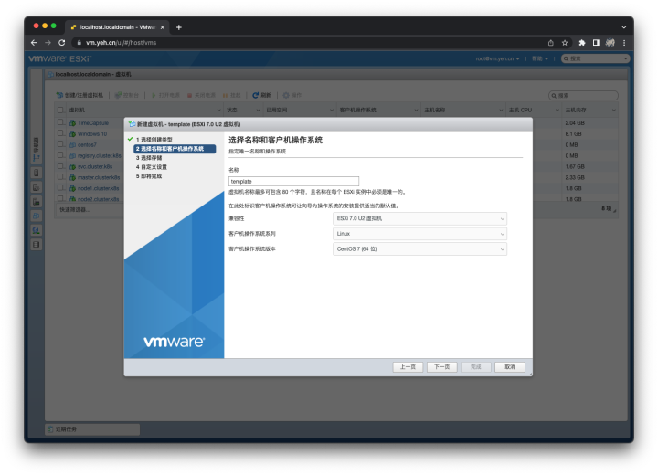
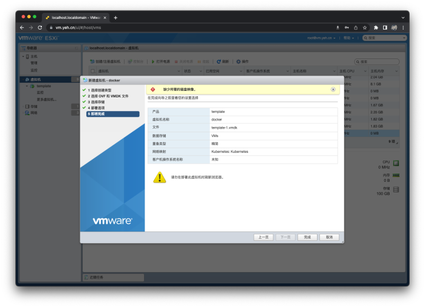

# 创建 EXSi 系统模板
## 概述
&emsp;&emsp;家里有个服务器，装了 Exsi 7.0 系统。由于在学习 Kubernetes，需要经常装虚拟机，因此这里记录一下创建 CentOS7 系统模板的过程。

&emsp;&emsp;题外话，VMware 还是挺好的，个人用的话，只要注册[[链接](https://customerconnect.vmware.com/cn/web/vmware/evalcenter?p=free-esxi7)]后，就可以免费直接赠送永久许可证，只不过该许可证有一点点限制，CPU 核心最大数量为 8 核，其余的限制基本忽略不计，个人用的话，功能绰绰有余。

## 创建模板
### 准备工作
- CentOS7 系统镜像[[下载](https://www.centos.org/download/)]

### 安装操作系统
&emsp;&emsp;选择创建/注册虚拟机。


&emsp;&emsp;选择创建新虚拟机，并填定虚拟机名称、操作系统、系统版本等信息。



&emsp;&emsp;保存到指定的存储中。


&emsp;&emsp;调整虚拟机的配置信息，主要包括 CPU 核心、内存大小、硬盘大小、网络适配器，注意，CD/DVD 驱动器 1 应选择 CentOS7 的系统安装镜像。


&emsp;&emsp;最后点击下一步和完成。开机，选择 Install CentOS7。


&emsp;&emsp;语言选择建议选择英语，因为中文有时会出现一些编码问题。


&emsp;&emsp;在这个步骤，需要调整三个位置。


- `INSTALLATION DESTINATION`：点进去直接选 Done 就好了。


- `NETWORK & HOST NAME`：这个步骤建议将 Host name 修改为 tempalte，Ethernet（ens192）打开，并调整为手动（Manual）配置 IPv4 信息。


- `DATE & TIME`：调整时区（Shanghai/Asia）和 NTP 服务器（ntp.aliyun.com）。


&emsp;&emsp;最后点击 Begin Installation。设置 root 用户密码。最后等待安装完毕，重启。


### 更新操作系统

&emsp;&emsp;成完 CentOS7 的系统安装后，重启进入系统，完成内核更新、升级依赖以及安装常用的工具。

- 升级内核

```bash
# CentOS 7 的默认内核是 3.10
$ uname -r
3.10.0-1160.el7.x86_64

# 添加内核仓库
$ rpm -Uvh http://www.elrepo.org/elrepo-release-7.0-4.el7.elrepo.noarch.rpm

# 安装最新内核
$ yum --enablerepo=elrepo-kernel install -y kernel-lt

# 设置开机从新内核启动 
$ grub2-set-default 'CentOS Linux (5.4.197-1.el7.elrepo.x86_64) 7 (Core)'

# 升级内核后需要重新启动
$ reboot

# 查看当前内核版本
$ uname -r
5.4.197-1.el7.elrepo.x86_64

# 卸载旧内核
$ yum remove -y kernel kernel-tools

# 重启系统，可以发现旧内核已经没有了
$ reboot
```

- 升级系统依赖和常用工具

```bash
# 升级系统依赖
$ yum update -y

# 安装常用工具
$ yum install -y nano net-tools wget bind-utils
```

&emsp;&emsp;完成以上操作之后，一个模板系统就已经完成了。关机，进行下一步操作。

### 导出系统
&emsp;&emsp;将已经制作好的模板系统导出。


&emsp;&emsp;导出之后，得到了三个文件：

- template-1.vmdk
- template.mf
- template.ovf

&emsp;&emsp;将这三个文件保存起来，后续需要创建新的虚拟机的时候，就可以通过这三个文件快速创建一个虚拟机，从而节省时间。

## 使用模板
### 创建新虚拟机
&emsp;&emsp;点击创建/注册虚拟机，选择从 OVF 或 OVA 文件部署虚拟机后，点击下一步。


&emsp;&emsp;输入新虚拟机的名称，并将刚才下载的 template-1.vmdk 文件和 template.ovf 文件拖到框里。


&emsp;&emsp;选择将新虚拟机保存到指定的存储中。


&emsp;&emsp;为其指定网络映射。点击下一步。


&emsp;&emsp;点击完成即可。警告可忽略。



&emsp;&emsp;点击完成之后，Exsi 会在后台启动上传任务，注意不要刷新浏览器。上传完毕后，Exsi 会自动将虚拟机开机。

### 修改配置
&emsp;&emsp;虚拟机开机之后，需要更改主机名（hostname）和 IP，防止与后面再创建的虚拟冲突了。

```bash
# 修改主机名
$ hostnamectl --static set-hostname docker

# 修改网络信息
$ nano /etc/sysconfig/network-scripts/ifcfg-ens192

# 修改 root 用户的密码
$ passwd root

# 完成以上操作后，重启系统即可
$ reboot
```

&emsp;&emsp;完成以上操作之后，一个新的操作系统镜像就完成了。