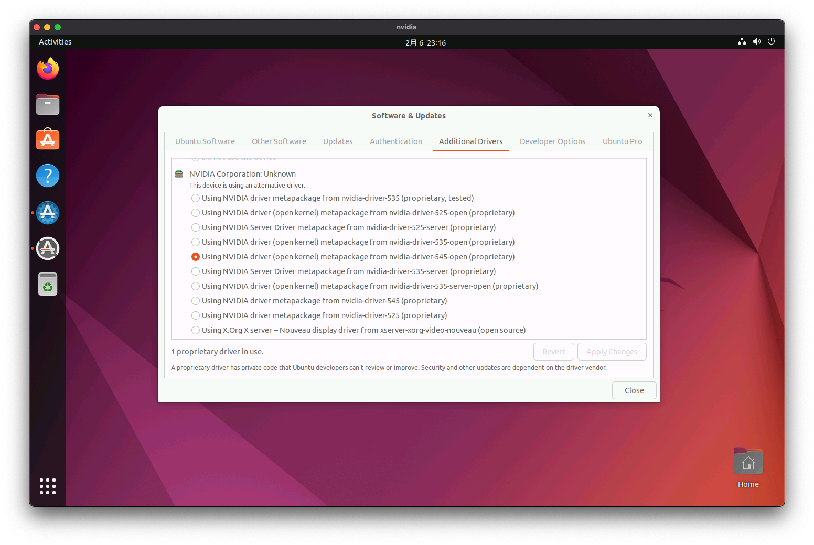

# Nvidia 驱动
## 概述
&emsp;&emsp;本文档主要记录一下在各个 Linux 发行版下安装 Nvidia 驱动的过程。

## 环境
- ESXi: 8.0 Update 2
- 显卡：NVIDIA GeForce RTX 4090

::: danger 提示
&emsp;&emsp;在 ESXi 的虚拟机里安装 Nvidia 驱动，需确保已关闭虚拟机配置`引导选项`里的 `启用 UEFI 安全引导`，否则可能会出现正常安装驱动后，但无法找到显卡的问题。详细操作请参考 GPU 直通文档[[链接](/blogs/vmware/esxi/gpu-pass-through)]。
:::

## Ubuntu Desktop 22.04.3
### 更新依赖
&emsp;&emsp;打开终端（Terminal），更新系统依赖。

```bash
$ sudo apt update
$ sudo apt upgrade
```

### 安装驱动
&emsp;&emsp;打开 `Software & Updates`，选择 `Additional Drivers` 选项卡，选择 `Using NVIDIA driver (open kernel) metapackage from nvidia-driver-545-open (proprietary)`，点击 `Apply` 完成驱动的安装。



&emsp;&emsp;驱动安装完毕后需重启系统。

### 验证驱动
&emsp;&emsp;重启后，打开终端（Terminal），输入 `nvidia-smi` 验证驱动是否正常安装。

```bash
$ nvidia-smi
Tue Feb  6 22:50:54 2024       
+---------------------------------------------------------------------------------------+
| NVIDIA-SMI 545.29.06              Driver Version: 545.29.06    CUDA Version: 12.3     |
|-----------------------------------------+----------------------+----------------------+
| GPU  Name                 Persistence-M | Bus-Id        Disp.A | Volatile Uncorr. ECC |
| Fan  Temp   Perf          Pwr:Usage/Cap |         Memory-Usage | GPU-Util  Compute M. |
|                                         |                      |               MIG M. |
|=========================================+======================+======================|
|   0  NVIDIA GeForce RTX 4090        Off | 00000000:03:00.0 Off |                  Off |
| 35%   29C    P8               7W / 450W |     19MiB / 24564MiB |      0%      Default |
|                                         |                      |                  N/A |
+-----------------------------------------+----------------------+----------------------+
                                                                                         
+---------------------------------------------------------------------------------------+
| Processes:                                                                            |
|  GPU   GI   CI        PID   Type   Process name                            GPU Memory |
|        ID   ID                                                             Usage      |
|=======================================================================================|
|    0   N/A  N/A      1588      G   /usr/lib/xorg/Xorg                            4MiB |
+---------------------------------------------------------------------------------------+
```
