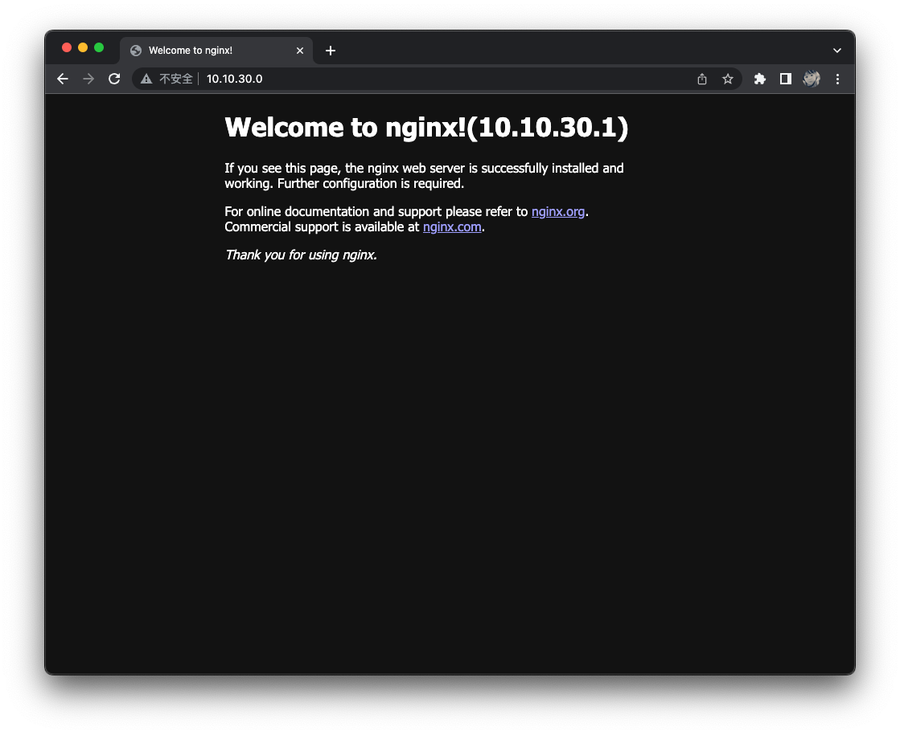

# Keepalived 搭建高可用
## 概述
&emsp;&emsp;Keepalived [[链接](https://www.keepalived.org)]是一个基于 VRRP （虚拟路由冗余）协议来实现的 LVS 服务高可用方案，能够利用其来避免单点故障。一个 LVS 服务会有 2 台或以上服务器运行 Keepalived，一台为主服务器（MASTER），其余为备份服务器（BACKUP），可是对外表现为一个虚拟 IP，主服务器会发送特定的消息给备份服务器，当备份服务器收不到这个消息的时候，即主服务器宕机的时候，备份服务器就会接管虚拟 IP，继续提供服务，从而保证了高可用性。Keepalived 是 VRRP 的完美实现。

&emsp;&emsp;Keepalived 的 MASTER 节点在工作时，会不断地向备用节点发送心跳信息，告诉 BACKUP 节点自己还活着。当主节点发生故障时，就无法发送心跳了，于是备用节点接管主节点的 IP 资源和服务。


&emsp;&emsp;如上图所示，在两台（或以上）服务器上安装 Keepalived 服务，这些服务可以共同虚拟出一个 IP 地址（10.10.30.0），客户端直接使用这个虚拟 IP 来访问服务器即可。两台服务器同时运行着相同的服务（Nginx）。Keepalived 会持续检查这个服务是否正常运行，如果服务异常时，将关掉 Keepalived 服务，虚拟 IP 将自动切换到其余的节点上提供服务。

> &emsp;&emsp;Keepalived 服务分别安装的主机 A 和 B 上，双方启动后，主机 A 就会向局域网内发送 ARP 响应包，该 ARP 响应包的 IP 地址会被设为 VIP，MAC 地址被设为 macA，所有接收此报文的电脑就会将这个对应关系写入自己的 ARP 缓存表中，下次访问 VIP 时，就会根据对应的 mac 地址访问到主机 A。
>
> &emsp;&emsp;当备份主机 B 监听到主机 A 挂了的时候，就会向局域网内发送 ARP 响应包，并将 ARP 响应包的 IP 地址设为 VIP，MAC 地址为为 macB，所有接收此报文件电脑将新的对应关系写入自己的 ARP 缓存表中，下次访问 VIP 时，就会根据对应的 mac 地址访问到主机 B。

## 配置
### 配置 master.keepalived
&emsp;&emsp;在 master.keepalived 节点上安装 keepalived、nginx 服务。

```bash
# 安装 keepalived 服务
$ yum install -y keepalived nginx
```

&emsp;&emsp;创建 nginx 进程检测脚本

- **/etc/keepalived/check_alived.sh**

```shell
#!/bin/bash
# 检测 nginx 是否启正常
if [ `ps -C nginx --no-header | wc -l` -eq 0 ]; then
    # nginx 不正常，则代表当前节点无法正常工作
    echo "nginx is not alived";
    exit 1;
else
    echo "nginx is alived";
    exit 0;
fi
```

```bash
# 给 /etc/keepalived/keepalived.conf 添加可执行权限
$ chmod +x /etc/keepalived/check_alived.sh
```


&emsp;&emsp;然后修改 keepalived 的配置

- **/etc/keepalived/keepalived.conf**

```
! Configuration File for keepalived

global_defs {
    router_id LVS_DEVEL           # 表示运行 keepalived 服务器的一个标识，这个标识需要是唯一的
    script_user root
    enable_script_security
}

# 定义脚本
vrrp_script check_alived {
    script "/etc/keepalived/check_alived.sh" # nginx 进程检测脚本
    interval 2                               # 检测间隔
    fail 1                                   # 定义检测失败最大次数。设置为 1 的话，表示请求失败 1 次就认为节点资源故障
    rise 1                                   # 定义检测成功资数。设置为 1 的话，表示请求成功 1 次就认为节点资源恢复正常
}

# 定义一个实例，VI_1 是实例名称，可以随便改
vrrp_instance VI_1 {
    state MASTER                  # MASTER 表示主节点，备用节点上用 BACKUP
    interface ens192              # 虚拟 IP 绑定的网络接口
    mcast_src_ip 10.10.30.1       # 当前服务器 IP 地址
    virtual_router_id 51          # 虚拟路由标识，数字，如果 keepalived 有多个实例，每个实例必须使用不一样的标识。MASTER 和 BACKUP 配置中相同的实例必须一致。
    priority 254                  # 节点的优先级（1~254），越大优先级越高。备用节点的优先级需要比主节点优先级低
    advert_int 2                  # MASTER 与 BACKUP 之间心跳检查的时间间隔
    authentication {              # 设置验证信息，节点间必须一致才能正常通信
        auth_type PASS
        auth_pass KP_PASS
    }
    virtual_ipaddress {           # 虚拟 IP 地址
        10.10.30.0
    }
    track_script {                # 检测脚本
        check_alived
    }
}
```

&emsp;&emsp;启动 Keepalived 服务

```bash
# 启动 keepalived 服务
$ systemctl start keepalived && systemctl enable keepalived
```

### 配置 backup.keepalived
&emsp;&emsp;在 backup.keepalived 节点上同样需要安装 keepalived、nginx 服务。

```bash
# 安装 keepalived 服务
$ yum install -y keepalived

# 创建 nginx 检测脚本，与主节点同容完全一致
$ vi /etc/keepalived/check_alived.sh

# 给 /etc/keepalived/keepalived.conf 添加可执行权限
$ chmod +x /etc/keepalived/check_alived.sh
```

&emsp;&emsp;然后修改 keepalived 的配置，与主节点不一致的地方已经用注释标出来了

- **/etc/keepalived/keepalived.conf**

```
! Configuration File for keepalived

global_defs {
    router_id LVS_DEVEL
    script_user root
    enable_script_security
}

vrrp_script check_alived {
    script "/etc/keepalived/check_alived.sh"
    interval 2
    fall 1
    rise 1
}

vrrp_instance VI_1 {
    state BACKUP                  # 备用节点上用 BACKUP
    interface ens192              # 虚拟 IP 绑定的网络接口
    mcast_src_ip 10.10.30.2       # 当前服务器 IP 地址
    virtual_router_id 51
    priority 100                  # 备用节点的优先级需要比主节点优先级低
    advert_int 2
    authentication {
        auth_type PASS
        auth_pass KP_PASS
    }
    virtual_ipaddress {
        10.10.30.0
    }
    track_script {
        check_alived
    }
}
```

&emsp;&emsp;启动 Keepalived 服务

```bash
$ systemctl start keepalived && systemctl enable keepalived
```

### 测试
&emsp;&emsp;访问虚拟 IP，发现请求由主节点处理了。



&emsp;&emsp;将主节点关机，或者杀掉 Nginx 进程，可以发现请求由备用节点处理了。

```bash
# 停止 nginx 服务
$ nginx -s stop

# 查看主节点 keeyalived 状态，发现 check_alive.sh 返回失败状态码
$ systemctl status keepalived
● keepalived.service - LVS and VRRP High Availability Monitor
   Loaded: loaded (/usr/lib/systemd/system/keepalived.service; enabled; vendor preset: disabled)
   Active: active (running) since 一 2023-05-29 03:19:43 CST; 46s ago
  Process: 2624 ExecStart=/usr/sbin/keepalived $KEEPALIVED_OPTIONS (code=exited, status=0/SUCCESS)
 Main PID: 2625 (keepalived)
   CGroup: /system.slice/keepalived.service
           ├─2625 /usr/sbin/keepalived -D
           ├─2626 /usr/sbin/keepalived -D
           └─2627 /usr/sbin/keepalived -D

2月 18 03:20:03 master.keepalived Keepalived_vrrp[2627]: /etc/keepalived/check_alived.sh exited with status 1
2月 18 03:20:03 master.keepalived Keepalived_vrrp[2627]: VRRP_Script(check_alived) failed
2月 18 03:20:04 master.keepalived Keepalived_vrrp[2627]: VRRP_Instance(VI_1) Entering FAULT STATE
2月 18 03:20:04 master.keepalived Keepalived_vrrp[2627]: VRRP_Instance(VI_1) removing protocol VIPs.
2月 18 03:20:04 master.keepalived Keepalived_vrrp[2627]: VRRP_Instance(VI_1) Now in FAULT state
2月 18 03:20:08 master.keepalived Keepalived_vrrp[2627]: /etc/keepalived/check_alived.sh exited with status 1
2月 18 03:20:13 master.keepalived Keepalived_vrrp[2627]: /etc/keepalived/check_alived.sh exited with status 1
2月 18 03:20:18 master.keepalived Keepalived_vrrp[2627]: /etc/keepalived/check_alived.sh exited with status 1
2月 18 03:20:23 master.keepalived Keepalived_vrrp[2627]: /etc/keepalived/check_alived.sh exited with status 1
2月 18 03:20:28 master.keepalived Keepalived_vrrp[2627]: /etc/keepalived/check_alived.sh exited with status 1
```


&emsp;&emsp;重新启动主节点，或者启动主节点的 Nginx 服务，可以发现请求又重新由主节点处理了。

```bash
# 重新启动 nginx 服务
$ systemctl restart nginx

# 查看 keeyalived 状态，发现重新开始广播
$ systemctl status keepalived
● keepalived.service - LVS and VRRP High Availability Monitor
   Loaded: loaded (/usr/lib/systemd/system/keepalived.service; enabled; vendor preset: disabled)
   Active: active (running) since 一 2023-05-29 03:19:43 CST; 2min 18s ago
  Process: 2624 ExecStart=/usr/sbin/keepalived $KEEPALIVED_OPTIONS (code=exited, status=0/SUCCESS)
 Main PID: 2625 (keepalived)
   CGroup: /system.slice/keepalived.service
           ├─2625 /usr/sbin/keepalived -D
           ├─2626 /usr/sbin/keepalived -D
           └─2627 /usr/sbin/keepalived -D

2月 18 03:21:49 master.keepalived Keepalived_vrrp[2627]: Sending gratuitous ARP on ens192 for 10.10.30.0
2月 18 03:21:49 master.keepalived Keepalived_vrrp[2627]: Sending gratuitous ARP on ens192 for 10.10.30.0
2月 18 03:21:49 master.keepalived Keepalived_vrrp[2627]: Sending gratuitous ARP on ens192 for 10.10.30.0
2月 18 03:21:49 master.keepalived Keepalived_vrrp[2627]: Sending gratuitous ARP on ens192 for 10.10.30.0
2月 18 03:21:54 master.keepalived Keepalived_vrrp[2627]: Sending gratuitous ARP on ens192 for 10.10.30.0
2月 18 03:21:54 master.keepalived Keepalived_vrrp[2627]: VRRP_Instance(VI_1) Sending/queueing gratuitous ARPs on ens192 for 10.10.30.0
2月 18 03:21:54 master.keepalived Keepalived_vrrp[2627]: Sending gratuitous ARP on ens192 for 10.10.30.0
2月 18 03:21:54 master.keepalived Keepalived_vrrp[2627]: Sending gratuitous ARP on ens192 for 10.10.30.0
2月 18 03:21:54 master.keepalived Keepalived_vrrp[2627]: Sending gratuitous ARP on ens192 for 10.10.30.0
2月 18 03:21:54 master.keepalived Keepalived_vrrp[2627]: Sending gratuitous ARP on ens192 for 10.10.30.0
```