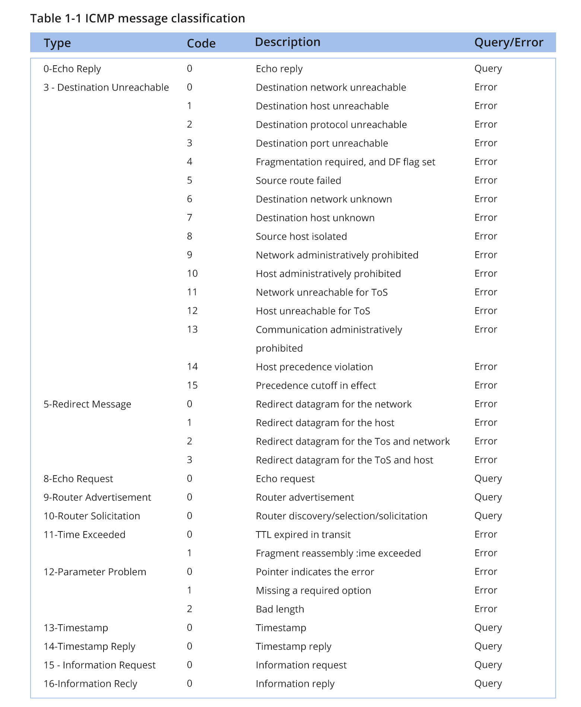

# iptables
## 概述
&emsp;&emsp;iptables 是 Linux 的防火墙工具，主要用于基于规则进行网络流量控制。由于 iptables 使用起来相对复杂，因此在 CentOS、Ubuntu 这些发行版本中，一般情况下默认使用更高层的封装，如 firewalld[[链接](/blogs/linux/network/firewalld)]、ufw。

&emsp;&emsp;在 Linux 下，但是 Docker、Kubernetes 这些容器工具一般与 iptables 整合来进行包转发，可能会与 firewalld、ufw 冲突（可以通过一些选项进行兼容性调整），因此在使用 Docker、Kubernetes 时，一般会将 firewalld、ufw 卸载之后直接使用 iptables 以保证容器环境的稳定运行。

&emsp;&emsp;本文档主要记录 iptables 的一些学习思路。

## 概念
### 防火墙
&emsp;&emsp;防火墙（Firewall）是一种网络安全系统，一般用于在内、外网之间或在计算机内部构建一道相对隔绝的保护屏障，以保护用户资料与信息安全性的一种技术。


&emsp;&emsp;如上图，从逻辑上讲，防火墙大体可以分为网络防火墙和主机防火墙：

- 网络防火墙：往往该主机位于网络（局域网）入口或边缘，以网关的形式对网络入口进行防护，保护网络内部所有主机。
- 主机防火墙：针对于单个主机（当前主机）内部的服务进行防护；

&emsp;&emsp;从物理上讲，防火墙可以分为硬件防火墙和软件防火墙：

- 硬件防火墙：在硬件级别实现部份防火墙功能以提升包处理速度，在软件级别实现防火墙配置。这类防火墙一般性能高，成本高；
- 软件防火墙：在通用硬件平台上，使用软件实现防火墙的所有功能。这类防火墙一般性能较低，成本也低。

&emsp;&emsp;一般情况下，一台网络防火墙可以同时保护多个主机，因此会使用硬件防火墙以保证这些主机的网络访问性能，像深信服防火墙等，部份路由器也会提供一些防火墙功能；主机防火墙一般只需要保护内部服务、端口的安全，使用软件防火墙基本能满足我们的性能要求，如此次我们学习的 iptables 就是软件防火墙。

&emsp;&emsp;iptables 实际上不是真正的防火墙，而是防火墙规则的维护工具，真正使用规则干活的是内核的 netfilter。iptables 构建规则指导 netfilter 完成封包过滤、封包重定向和网络地址转换（Network Address Translate，NAT）等功能。

&emsp;&emsp;iptables 有三个核心概念，分别是`规则（rule）`、`链（chain）`、`表（table）`。为了更好地管理 iptables，我们需要先学习这三个核心概念。

### 规则（rule）
&emsp;&emsp;iptables 通过定义规则来处理包，一般定义为`如果数据包符合这样的条件，就这样处理`。像`来自 10.10.3.0/24 的包，就将其拒绝（reject）`，这就是一条规则。

&emsp;&emsp;规则存储在内核空间的信息包过滤表中，这些规则通过指定包的源地址（source）、目标地址、传输协议（如 TCP、UDP、ICMP）和服务类型（如 HTTP、FTP、SMTP）来确认是否匹配条件。当数据包与规则匹配时，netfilter 就根据规则所定义的方法来处理这些数据包，如放行（accept）、拒绝（reject）、丢弃（drop）等。

&emsp;&emsp;规则是 iptables 里面的最小单元。

### 链（chain）
&emsp;&emsp;为了方便管理与理解，iptables 将同一类型的规则放在链上，根据规则的优先级依次执行。iptables 为我们预定义了 5 条链，每条链的工作职责如下：

- `PREROUTING`: 包到达网口时，对其进行匹配并处理
- `INPUT`: 包到达本地主机目标端口时，对其进行匹配并处理
- `OUTPUT`: 本地主机端口/服务处理好的包返回时，对其进行匹配并处理
- `FORWARD`: 包路由转发时，对其进行匹配并处理
- `POSTROUTING`: 包离开网口时，对其进行匹配并处理

&emsp;&emsp;当包经过防火墙的时候，根据包的类型（发给当前主机/其它主机）让不同的链去处理这些包。


::: tip 提示
&emsp;&emsp;一般情况下，网络防火墙与主机防火墙分别主要使用以下链：

- 网络防火墙：这种防火墙主要用于包转发，因此需要用到 `PREROUTING`、`FORWARD`、`POSTROUTING` 这三条链；
- 主机防火墙：这种防火墙主要将包发送给端口服务，因此需要用到 `PREROUTING`、`INPUT`、`OUTPUT`、`POSTROUTING` 这四条链，其中：
   - 包从网卡到端口使用到 `PREROUTING` 和 `INPUT` 这两条链；
   - 服务完成包的处理之后，包从端口返回网卡使用到了 `OUTPUT` 和 `POSTROUTING` 这两条链。
  :::

### 表（table）
&emsp;&emsp;iptables 将相同类型的规则放同一条链上，但是链上的规则有些能力是很相似的，比如 A 类规则都是用于对 IP 或端口进行过滤，B 类规则都是修改报文，因此 iptables 引入了表的概念，用于分类存放不能功能的规则。iptables 内置了 4 张表，分别如下：

- RAW: 这里面的链、规则，主要能基于数据包的状态进行规则的设定。
- MANGLE: 这里面的链、规则，主要决定数据包的内容；
- NAT: 这里面的链、规则，主要可以修改源和目标的 ip 地址，从而进行包路由；
- FILTER: 这里面的链、规则，主要决定一个数据包是否可以到达目标进程的端口；

&emsp;基于以上表的能力职责，由于某些链天生不具备某些能力，故而链与表之间的关系如下：


::: tip 提示
&emsp;&emsp;在 CentOS 7 中，INPUT 链有 NAT 表，但是 CentOS 6 没有。
:::

&emsp;&emsp;一个链下的 4 个表，其执行顺序为 `RAW` > `MMANGLE` > `NAT` > `FILTER`，然后再根据规则的优先级从上至下执行。

## 规则管理
### 环境准备
&emsp;&emsp;为了实验 iptables，现需要准备 2 台服务器环境：

- 10.10.4.1: 运行 iptables 的服务器，模拟主机防火墙和网络防火墙
- 10.10.4.2: 运行 nginx 服务，模拟网络防火墙背后的主机，测试 iptables 作为网络防火墙的效果
- 10.10.5.2: 访问 10.10.4.1，模拟客户端访问防火墙，测试 iptables 规则

### 创建规则
&emsp;&emsp;在上面关于规则的概念中，我们知道规则是根据匹配条件来执行对应包的处理动作。这里涉及到两块内容，一块是匹配条件，一块是处理动作。

&emsp;&emsp;在 iptables 里，匹配条件分为基础匹配条件和扩展匹配条件。基础匹配条件是 iptables 内置的，而扩展匹配条件需要配合插件完成。通过以下实验测试添加规则：

```bash
# 在添加规则前，我们先确保 10.10.5.2 可以访问 10.10.4.1
# 在 10.10.5.2 服务器上使用 ping 访问 10.10.4.1
$ ping 10.10.4.1 -c 4
PING 10.10.4.1 (10.10.4.1) 56(84) bytes of data.
64 bytes from 10.10.4.1: icmp_seq=1 ttl=64 time=0.493 ms
64 bytes from 10.10.4.1: icmp_seq=2 ttl=64 time=0.127 ms
64 bytes from 10.10.4.1: icmp_seq=3 ttl=64 time=0.482 ms
64 bytes from 10.10.4.1: icmp_seq=4 ttl=64 time=0.457 ms
```

```bash
# 现在在 10.10.4.1 服务器上添加一条规则
# 在 filter 表的 INPUT 链添加一条规则，将来自 10.10.5.2 的包都拒绝
# -t: 目标表
# -I: 表示新增规则，后面的参数是待新增的链
# -s: 匹配规则，源地址
# -j: 动作
$ iptables -t filter -I INPUT -s 10.10.5.2 -j REJECT

# 再次查看 filter 表的规则，可以发现在 INPUT 链中，已添加了一条规则，后面的描述为 reject-with icmp-port-unreachable
$ iptables -t filter -L
Chain INPUT (policy ACCEPT)
target     prot opt source               destination         
REJECT     all  --  10.10.5.2            anywhere             reject-with icmp-port-unreachable

Chain FORWARD (policy ACCEPT)
target     prot opt source               destination         

Chain OUTPUT (policy ACCEPT)
target     prot opt source               destination         
```

```bash
# 在 10.10.5.2 服务器上再次使用 ping 访问 10.10.4.1
# 发现服务器返回 Destination Port Unreachable 错误，配置的描述一致，因此可以确认规则已生效
$ ping 10.10.4.1 -c 4
PING 10.10.4.1 (10.10.4.1) 56(84) bytes of data.
From 10.10.4.1 icmp_seq=1 Destination Port Unreachable
From 10.10.4.1 icmp_seq=2 Destination Port Unreachable
From 10.10.4.1 icmp_seq=3 Destination Port Unreachable
From 10.10.4.1 icmp_seq=4 Destination Port Unreachable

--- 10.10.4.1 ping statistics ---
4 packets transmitted, 0 received, +4 errors, 100% packet loss, time 3000ms
```

### 查询规则
&emsp;&emsp;在上一章节提到，我们可以使用 `iptables -t filter -L` 命令列出 filter 表中所有的规则，接下来我们看看该命令的详细情况：
```bash
# 查询规则
# -t: 可选项。查询指定表，可选 raw、mangle、nat、filter，不指定时默认查询 filter 表
# -v: 可选项。查询详细信息
# -n: 可选项。查询原始信息
# -L: 必选项。查询规则。查询指定链，不指定链名时，返回该表下所有链的信息
$ iptables [-t <table>] -[vn]L [chain]

# 忽略了 -t 参数，则默认查询 filter 表
$ iptables -L
Chain INPUT (policy ACCEPT)
target     prot opt source               destination         
REJECT     all  --  10.10.5.2            anywhere             reject-with icmp-port-unreachable

Chain FORWARD (policy ACCEPT)
target     prot opt source               destination         

Chain OUTPUT (policy ACCEPT)
target     prot opt source               destination         

# 也可以指定只查询 INPUT 链的规则
$ iptables -L INPUT
Chain INPUT (policy ACCEPT)
target     prot opt source               destination         
REJECT     all  --  10.10.5.2            anywhere             reject-with icmp-port-unreachable

# 添加 -v 选项，可以查看到更多、更详细的信息
$ iptables -vL INPUT
Chain INPUT (policy ACCEPT 277 packets, 25052 bytes)
 pkts bytes target     prot opt in     out     source               destination         
    4   336 REJECT     all  --  any    any     10.10.5.2            anywhere             reject-with icmp-port-unreachable

# 在上述命中，iptables 对一些结果进行名称解析。如果规则比较多，则效率会比较低，因此可以添加 -n 选项查看原始值
$ iptables -nvL INPUT
Chain INPUT (policy ACCEPT 377 packets, 34100 bytes)
 pkts bytes target     prot opt in     out     source               destination         
    4   336 REJECT     all  --  *      *       10.10.5.2            0.0.0.0/0            reject-with icmp-port-unreachable
[root@centos7 ~]# 
```

&emsp;&emsp;使用 `-v` 选项查看信息时，各字段含义如下：

- **pkts**: 该规则匹配到的报文的个数。刚才我们使用 `ping <ip> -c 4` 命令，因此这里匹配到了 4 个包；
- **bytes**: 该规则匹配到的报文包的大小总和；
- **target**: 规则对应的 target，一般表示规则匹配成功后需要采取的动作。除此之后，target 也可能为 `子链`，表示规则匹配成功后由指定子链的规则进行处理；
- **prot**: 表示规则对应的协议；
- **opt**: 表示规则对应的选项；
- **in**: 表示数据包由哪个接口/网卡流入；
- **out**: 表示数据包由哪个接口/网卡流出；
- **source**: 表示规则对应的源地址，可以是一个 IP，也可以是一个网段；
- **destination**: 表示规则对应的目标地址，可以是一个 IP，也可以是一个网段。

&emsp;&emsp;同时，在上面的结果面，可以看到 INPUT 链后面的行号中包含 `policy ACCEPT xxx packets, xxx bytes` 这三部份：

- **policy**: 表示链的默认策略，意思是如果包没有匹配上规则时默认执行的动作。在上面的案例中，INPUT 链默认策略是 `ACCEPT`，意思是默认发行。这种情况代表的 INPUT 链执行的是`黑名单`机制，默认所有包都能通过，只有指定的包不能通过；
- **packets**: 表示当前链默认策略匹配到的包的数量；
- **bytes**: 表示当前链默认策略匹配到的所有包的大小总和。

## 高级用法
### 基础匹配条件
&emsp;&emsp;iptables 的匹配条件分为基础匹配条件和扩展匹配条件。基础匹配条件是 iptables 内置的，可以直接使用，而扩展匹配条件需要依赖一些扩展模块，一般需要通过 `-m` 选项指定扩展模块。

&emsp;&emsp;接下来先介绍基础匹配条件。

#### 源地址匹配
&emsp;&emsp;在上面的创建规则时，我们使用 `-s` 作为匹配条件，可以匹配包的源地址，通过以下方式，也可以有更多的用法：

```bash
# 匹配单个 IP
$ iptables -t filter -I INPUT -s 10.10.5.2 -j DROP

# 匹配多个 IP，使用 , 隔开
$ iptables -t filter -I INPUT -s 10.10.5.2,10.10.5.3 -j DROP

# 匹配一个网段
$ iptables -t filter -I INPUT -s 10.10.5.0/24 -j REJECT

# 可以对匹配条件取反
$ iptables -t filter -I INPUT ! -s 10.10.5.2 -j ACCEPT
```

::: warning 警告
&emsp;&emsp;在上面的示例中，使用 `! -s 10.10.5.2` 表示对 `-s 10.10.5.2` 这个条件取反，表示源地址 IP 只要不为 `10.10.5.2` 即满足条件执行放行动作。可能很多人可能认为这条规则也可以理解为“只要是 10.10.5.2 的报文，那么就不接受”，虽然含义上相不多，但是在执行上是完全不一样的。因为上面的条件只表达了其它除了 10.10.5.2 以外的 IP 包的处理动作，但是却没指定 10.10.5.2 的处理动作，可以同样是 ACCEPT，可以 DROP，也可以是 REJECT。
:::

#### 目标地址匹配
&emsp;&emsp;通过 `-d` 来创建目标匹配条件，与 `-s` 的用法基本一致。

```bash
# 匹配单个 IP
$ iptables -t filter -I INPUT -d 10.10.5.2 -j DROP

# 匹配多个 IP，使用 , 隔开
$ iptables -t filter -I INPUT -d 10.10.5.2,10.10.5.3 -j DROP

# 匹配一个网段
$ iptables -t filter -I INPUT -d 10.10.5.0/24 -j REJECT

# 可以对匹配条件取反
$ iptables -t filter -I INPUT ! -d 10.10.5.2 -j ACCEPT
```

::: tip 提示
&emsp;&emsp;目标地址匹配一般用在以下两个场景：

1. 当前主机有两个网卡，通过防火墙想对其中一个网卡添加规则；
2. 当前主机是网关，通过防火墙对内部主机添加规则。
:::

#### 协议类型匹配
&emsp;&emsp;通过 `-p` 选项来添加需要匹配的协议类型。`-p` 选项支持以下二人协议:

- tcp
- udp
- udplite
- icmp
- icmpv6
- esp
- ah
- sctp
- mh

```bash
# 拒绝来自 10.10.5.2 的 icmp 协议的包
# ping 命令使用 icmp 协议，也就是此时 10.10.5.2 将无法 ping 通本机
$ iptables -t filter -I INPUT -s 10.10.5.2 -p icmp -j REJECT
```

::: tip 提示
&emsp;&emsp;在添加规则时，指定多个匹配条件时，这些条件之间默认存在 `与` 关系。
:::

#### 网卡/接口匹配
&emsp;&emsp;通过 `-i` 或 `-o` 选项添加网卡/接口匹配规则。`-i` 表示包从哪个网卡流入本机，`-o` 表示从哪块网卡流出本机。当本机有多个网卡时，可以使用此选项添加网卡/接口匹配条件。

```bash
# 获取本机网卡信息
$ ifconfig
ens192: flags=4163<UP,BROADCAST,RUNNING,MULTICAST>  mtu 1500
        inet 10.10.4.1  netmask 255.255.0.0  broadcast 10.10.255.255
        inet6 fe80::7dcd:991d:a8dc:1ac1  prefixlen 64  scopeid 0x20<link>
        ether 00:50:56:aa:d9:58  txqueuelen 1000  (Ethernet)
        RX packets 39683  bytes 37554827 (35.8 MiB)
        RX errors 0  dropped 0  overruns 0  frame 0
        TX packets 15318  bytes 992553 (969.2 KiB)
        TX errors 0  dropped 0 overruns 0  carrier 0  collisions 0
...

# 添加入站规则
$ iptables -t filter -I INPUT -i ens192 -p icmp -j DROP

# 添加出库规则
$ iptables -t filter -I OUTPUT -o ens192 -j DROP
```

::: tip 提示
&emsp;&emsp;回顾概念章节里面的 iptables 报文流向图，可以发现有的报文件别的主机发到本机的，有的报文是本机发送给其它主机的。因此我们可以得出以下结论：
- `-i` 选项只能用于 `PREROUTING`、`INPUT`、`FORWARD` 这三条链
- `-o` 选项只能用于 `FORWARD`、`OUTPUT`、`POSTROUTING` 这三条链。
:::

### 扩展匹配条件
&emsp;&emsp;上面的章节已经完成基础匹配条件的介绍，那么接下来我们介绍一下扩展匹配条件。

#### icmp
&emsp;&emsp;ICMP（Internet Control Message Protocol，互联网控制报文协议）主要用于探测网络上的主机是否可用、目标是否可达、网络是否通畅、路由是否可用等等，最常用的 `traceroute`、`ping` 命令使用的就是 ICMP 协议。

&emsp;&emsp;使用 ping 命令 ping 某主机时，如果主机可达，对应主机会对该 ping 请求做出回应（此处不考虑禁 ping 等情况）。根据 RFC792 标准[[链接](https://www.rfc-editor.org/rfc/inline-errata/rfc792.html)]，ping 请求报文属于类型 `8/0` 的 ICMP 报文，而响应报文属于类型 `0/0` 的响应报文，具体如下：



&emsp;&emsp;icmp 模块可以用于匹配指定 `type`、`code` 的报文：

- `--icmp-type`：匹配指定类型的 ICMP 报文

```bash
# 禁止所有 icmp 类型的报文进入本机
# 以下命令虽然可以禁止别的主机向本机发送 ping 请求，但同时也会造成本主机无法 ping 别的主机（因为响应报文被 REJECT）
$ iptables -t filter -I INPUT -p icmp -j REJECT

# 由于响应报文的标识为 8/0（type 为 8，code 为 0），因此可以只拒绝请求报文
# 这样当前主机就可以正常使用 ping 命令了
$ iptables -t filter -I INPUT -p icmp --icmp-type 8/0 -j REJECT

# 也可以使用报文名称去匹配对应类型的报文
$ iptables -t filter -I INPUT -p icmp --icmp-type "echo-request" -j REJECT
```

#### tcp/udp
&emsp;&emsp;基础匹配条件里，没有提供`源端口`和`目标端口`这两个匹配条件。如果需要对端口进行匹配，则需要借助 tcp/udp 扩展模块。

&emsp;&emsp;tcp/udp 模块支持以下配匹配条件：

- `--sport`：添加源端口匹配条件，支持取反操作；
- `--dport`：添加目标端口匹配条件，支持取反操作；
- `--tcp-flags`：<font color=red>只能用于 tcp 协议</font>，根据 tcp 报文类型作为匹配条件；
- `--syn`：<font color=red>只能用于 tcp 协议</font>，用于匹配 tcp 新建连接的请求报文，相当于 `--tcp-flags SYN,RST,ACK,FIN SYN`。

```bash
# 拒绝来自 10.10.5.2 的 ssh 请求
# 使用 --dport 时，必须事先指定使用了哪种协议，即必须先使用 -p 选项
# 确认了协议之后，则需要使用 -m 选项指定扩展模块
$ iptables -t filter -I INPUT -s 10.10.5.2 -p tcp -m tcp --dport 22 -j REJECT

# 拒绝目标端口不是 22 的所有报文
$ iptables -t filter -I INPUT -s 10.10.5.2 -p tcp !--dport 22 -j REJECT

# 可以指定一个端口范围
# 拒绝目标端口范围为 [22, 25] 的所有报文，也就是拒绝目标端口为 22、23、24、25 的所有报文
# 如果端口范围写成 :22 代表匹配 [0, 22] 的端口
# 如果端口范围写成 80: 代理匹配 [80, 65535] 的端口
$ iptables -t filter -I INPUT -s 10.10.5.2 -p tcp --dport 22:25 -j REJECT
```

::: tip 提示
&emsp;&emsp;在上面的案例中，可以忽略 `-m` 选项。当使用了 `-p` 选项时，如果没有使用 `-m` 指定使用哪个扩展模块，iptables 会默认使用与协议名称相同的模块。
:::

&emsp;&emsp;`--tcp-flags` 主要用于匹配 TCP 报头里面的标志位，用于匹配特定的传输报文。

```bash
# 以下命令的意思是需要匹配 SYN,ACK,FIN,RST,URG,PSH 这 6 个标志位信息，其中 SYN 必须为 1，其余必须为 0
# 也就是 TCP 三次握手里面的第一次握手的情况
# 拒绝第一次握手即表示拒绝建立 TCP 连接
$ iptables -t filter -I INPUT -p tcp -m tcp --dport 22 --tcp-flags SYN,ACK,FIN,RST,URG,PSH SYN -j REJECT

# 以下命令的意思是需要匹配 SYN,ACK,FIN,RST,URG,PSH 这 6 个标志位信息，其中 SYN、ACK 必须为 1，其余必须为 0
# 也就是 TCP 三次握手里面的第二次握手的情况
$ iptables -t filter -I INPUT -p tcp -m tcp --dport 22 --tcp-flags SYN,ACK,FIN,RST,URG,PSH SYN,ACK -j REJECT

# 还可以简写为以下
$ iptables -t filter -I INPUT -p tcp -m tcp --dport 22 --tcp-flags ALL SYN -j REJECT

# tcp 模块还贴心地提供了第一次握手的简写
$ iptables -t filter -I INPUT -p tcp -m tcp --dport 22 --syn -j REJECT
```

#### state
&emsp;&emsp;在 icmp 章节中，如果我们直接禁用 icmp 类型的报文，则不仅其它主机无法 ping 本机，本机也无法 ping 其它主机。为了解决这个问题，我们需要区分 icmp 报文的类型，只拒绝 `8/0` 类型的报文，放行其它类型的 icmp 报文，才能让本机的 ping 命令正常工作。

&emsp;&emsp;同理，在 tcp/udp 协议中，当我们通过 http 访问服务器的时候，客户端向服务器的 80 端口发起请求，服务端再通过 80 端口响应我们的请求，于是作为客户端，我们应当需要放行 80 端口，以便服务端的响应报文可以进入到客户端主机。但如果这样的话，那么其它主机如果通过 80 端口主动向客户端主机发送数据时，由于客户端的主机因为已经放行了 80 端口，那么就客户端主机就可以可以接收到这些数据，这样就会造成客户端产生一定的风险。

&emsp;&emsp;为了解决这个问题，客户端可以选择针对已知安全的主机放行对应的端口，其他 IP 一律拒绝来保证客户端主机的安全。但是随着主机越来越多，这样的放行规则就越来越多，配置越来越复杂，从而产生维护困难等问题。如果通过 `--tcp-flags` 选项将外来的“第一次握手”的请求拒绝，那对方仍然可以通过 UDP、ICMP 协议等向客户端发送数据，仍然无法保证客户端主机的安全。

&emsp;&emsp;iptables 的 state 模块可以方便的解决以上问题。<font color=red>state 模块可以让 iptables 实现“连接追踪”机制</font>。在 TCP/IP 协议簇中，UDP 和 ICMP 是没有连接的，但对于 state 模块来说，tcp 报文、udp 报文、icmp 报文都是有连接状态的，只要两台主机在“你来我往”地通信，就算建立起连接。

&emsp;&emsp;对于 state 模块的连接而言，报文可以分为 5 种状态：

- `NEW`：连接中的第一个包，状态就是 NEW，可以理解为新连接的第一个包的状态为 NEW；
- `ESTABLISHED`：NEW 状态包后面的包的状态为 ESTABLISHED，表示连接已建立；
- `RELATED`：如果两个连接有关联关系，则其中一个连接会被标为 RELATED；
- `INVALID`：如果一个包没有办法被识别，或者这个包没有任何状态，那么这个包的状态就是 INVALID
- `UNTRACKED`：报文未被追踪，通常表示报文无法找到相关连的连接。

&emsp;&emsp;解决以上问题的关键在于如何区分报文是否为了回应之前发出去的报文。那么通过 state 模块，可以将 `ESTABLISHED`、`RELATED` 状态的报文放行即可，表示放行回应我们的的报文。

&emsp;&emsp;state 模块支持以下参数：

- `--state`：匹配指定状态的报文，多种状态使用 , 连接。

```bash
# 放行连接状态为 ESTABLISHED、RELATED 的报文
$ iptables -t filter -I INPUT -m state --state ESTABLISHED,RELATED -j ACCEPT
# 拒绝所有报文
$ iptables -t filter -A INPUT -j REJECT

# 使用 ssh 访问其它服务器，可以正常工作
$ ssh root@10.10.5.2
root@10.10.5.2's password: 
```

```bash
# 在其它主机上访问 10.10.4.1 时，无法正常连接
$ ssh root@10.10.4.1
ssh: connect to host 10.10.4.1 port 22: Connection refused

# 也无法 ping 通 10.10.4.1
$ ping 10.10.4.1 -c4
PING 10.10.4.1 (10.10.4.1) 56(84) bytes of data.
From 10.10.4.1 icmp_seq=1 Destination Port Unreachable
From 10.10.4.1 icmp_seq=2 Destination Port Unreachable
From 10.10.4.1 icmp_seq=3 Destination Port Unreachable
From 10.10.4.1 icmp_seq=4 Destination Port Unreachable

--- 10.10.4.1 ping statistics ---
4 packets transmitted, 0 received, +4 errors, 100% packet loss, time 3000ms
```

#### multiport
&emsp;&emsp;tcp/udp 扩展模块只能匹配连续的端口范围，如果需要指定多个离散的、不连续的端口，则需要借助 multiport 模块。

&emsp;&emsp;multiport 模块支持以下参数：

- `--sports`：源端口
- `--dports`：目标端口

```bash
# 拒绝目标端口为 22、80、443 端口的报文
$ iptables -t filter -I INPUT -s 10.10.5.2 -p tcp -m multiport --dports 22,80,443 -j REJECT

# 在 multiport 模块，也可以指定端口范围
$ iptables -t filter -I INPUT -s 10.10.5.2 -p tcp -m multiport --dports 22,80,1000: -j REJECT
```

::: warning 警告
&emsp;&emsp;multiport 扩展模块只能用于 tcp 协议和 udp 协议，即需要配合 `-p tcp` 或 `-p udp` 使用。
:::

#### iprange
&emsp;&emsp;在上面的章节中，我们只能使用 `-s` 或 `-d` 表示源地址与目标地址，可以同时指定多个 IP（每个 IP 用 , 隔开），也可以指事实上一个网段（10.10.5.0/24），但是不能一次性指定一段连续的 IP 地址范围。如果我们需要指定一段连续的 IP 地址范围，那么需要借助 `iprange` 扩展模块。

&emsp;&emsp;通过 iprange 的 `--src-range` 选项指定源地址范围，使用 `--dst-range` 选项指定目标地址范围

```bash
# 丢弃源 IP 地址在 10.10.5.[2, 100] 范围的报文
$ iptables -t filter -I INPUT -m iprange --src-range 10.10.5.2-10.10.5.100 -j DROP

# 可以对 IP 范围进行取反
$ iptables -t filter -I INPUT -m iprange !--src-range 10.10.5.2-10.10.5.100 -j DROP
```

#### string
&emsp;&emsp;使用 string 扩展模块可以用于指定需要匹配的字符串，如报文中包含对应的字符串，则命中匹配条件。

&emsp;&emsp;使用 string 模块时，我们需要指定以下两个选项：

- `--algo`：必选项，指定匹配算法。可选算法有 `bm` 与 `kmp`；
- `--string`: 必须项，指定待匹配字符串。

```bash
# 拒绝报文中存在 test 的报文
$ iptables -t filter -I INPUT -m string --alog bm --string "test" -j REJECT
```

#### time
&emsp;&emsp;使用 time 扩展模块，可以根据时间段匹配报文。如果报文到达时间在指定时间范围，则命中匹配条件。

&emsp;&emsp;使用 time 模块时，支持以下选项：

- `--timestart`：可选项，指定起始时间，时间格式为 `HH:mm:ss`
- `--timestop`：可选项，指定结束时间，时间格式为 `HH:mm:ss`
- `--weekdays`：可选项，指定每个星期的哪些天。可以通过数字 1～7 表示，也可以通过 Mon, Tue, Wed, Thu, Fri, Sat, Sun 表示。支持取反操作
- `--monthdays`：可选项，指定每月的哪些天。支持取反操作
- `--datestart`：可选项，指定开始日期，时间格式为 `yyyy-MM-dd`
- `--datestop`：可选项，指定结束日期，时间格式为 `yyyy-MM-dd`

```bash
# 指定时间范围
$ iptables -t filter -I OUTPUT -p tcp --dport 80 -m time --timestart 09:00:00 --timestop 18:00:00 -j REJECT

# 周六、日不能访问 80 端口
$ iptables -t fitler -I OUTPUT -p tcp --dport 80 -m time --weekdays 6,7 -j REJECT

# 每月 22、23 号不能访问 80 端口
$ iptables -t filter -I OUTPUT -p tcp --dport 80 -m time --monthdays 22,23 -j REJECT

# 2024 年 1 月 22 日到 2025 年 1 月 22 日不能访问 80 端口
$ iptables -t filter -I OUTPUT -p tcp --dport 80 -m time --datestart 2024-01-22 --datestop 2025-01-22 -j REJECT
```

#### connlimit
&emsp;&emsp;使用 connlimit 扩展模块，可以限制每个 IP 地址同时连接到 server 端的连接数量。如果不指定 IP，则默认针对`每个客户端 IP`，即对单个 IP 的并发连接数限制。

&emsp;&emsp;使用 connlimit 模块时，支持以下选项：

- `--connlimit-above`：限制每个 IP 地址最多占用链接数。对其取反，则与 `--connlimit-opto` 含义相同；
- `--connlimit-opto`：每个 IP 的连接数不超过指定链接数，则允许链接。CentOS 7 以后才可以使用；
- `--connlimit-mask`：限制网段的连接数量。根据连接进来的 IP 计算网段。

```bash
# 每个 IP 地址只能占用两个 ssh 连接
$ iptables -t filter -I INPUT -p tcp --dport 22 -m connlimit --connlimit-above 2 -j REJECT

# 如果 IP 地址占用链接数不超过 2 个，则接受
# 注意，此规则不代表 IP 地址占用链接超过 2 个就拒绝
# 因为 connlimit 的目标是限制链接数量，因此取反操作相对比较少用
$ iptables -t filter -I INPUT -p tcp --dport 22 -m connlimit --connlimit-above 2 -j ACCEPT

# 根据连接进来的 IP 计算网段，相同网段的 IP 共用连接数
# 如 192.168.101.173 访问，则以下规则的意思是 192.168.101.0/24 这个网段下所有的 IP 共用 2 个链接数
# 如果其中一台主机占用了 2 个链接数，则其余所有的 IP 都无法连接
$ iptables -t filter -I INPUT -p tcp --dport 22 -m connlimit --connlimit-above 2 --connlimit-mask 24 -j REJECT
```

#### limit
&emsp;&emsp;使用 limit 扩展模块，可以限制单位时间内流入的包的数量，从而限制流量速率。limit 扩展模块使用 `令牌桶` 算法进行限流。

&emsp;&emsp;使用 limit 模块时，支持以下选项：

- `--limit`：速率限制。如 `10/minute`。可选单位有 `/second`、`/minute`、`/hour`、`/day`。
- `--limit-burst`：令牌桶容量，默认为 5。

```bash
# 每分钟释放 10 个令牌（也就是每 6 秒一个令牌）
$ iptables -t filter -I INPUT -p icmp -m limit --limit 10/minute -j ACCEPT

# 注意，limit 模块只是说以 10/minute 速率接收，不代表其余的会被拒绝
# 由于 INPUT 链的默认规则是 ACCEPT，因此未被这个规则匹配上的报文也会被 ACCEPT
# 为了让上面的限流生效，可以修改链的默认策略
$ iptables -t filter -A INPUT -p icmp -j REJECT
```

```bash
# 在其它主机使用 ping 命令测试令牌桶
$ ping 10.10.4.1
PING 10.10.4.1 (10.10.4.1) 56(84) bytes of data.
64 bytes from 10.10.4.1: icmp_seq=1 ttl=64 time=0.252 ms
64 bytes from 10.10.4.1: icmp_seq=2 ttl=64 time=0.577 ms
64 bytes from 10.10.4.1: icmp_seq=3 ttl=64 time=0.550 ms
64 bytes from 10.10.4.1: icmp_seq=4 ttl=64 time=0.491 ms
64 bytes from 10.10.4.1: icmp_seq=5 ttl=64 time=0.661 ms
From 10.10.4.1 icmp_seq=6 Destination Port Unreachable
64 bytes from 10.10.4.1: icmp_seq=7 ttl=64 time=0.254 ms
From 10.10.4.1 icmp_seq=8 Destination Port Unreachable
From 10.10.4.1 icmp_seq=9 Destination Port Unreachable
From 10.10.4.1 icmp_seq=10 Destination Port Unreachable
From 10.10.4.1 icmp_seq=11 Destination Port Unreachable
From 10.10.4.1 icmp_seq=12 Destination Port Unreachable
64 bytes from 10.10.4.1: icmp_seq=13 ttl=64 time=0.588 ms
From 10.10.4.1 icmp_seq=14 Destination Port Unreachable
From 10.10.4.1 icmp_seq=15 Destination Port Unreachable
```

::: tip 提示
&emsp;&emsp;注意，如果令牌桶的容量空了，那么 limit 会根据速度定速向令牌桶添加领牌。超过令牌桶容量的令牌将被丢弃。
:::
