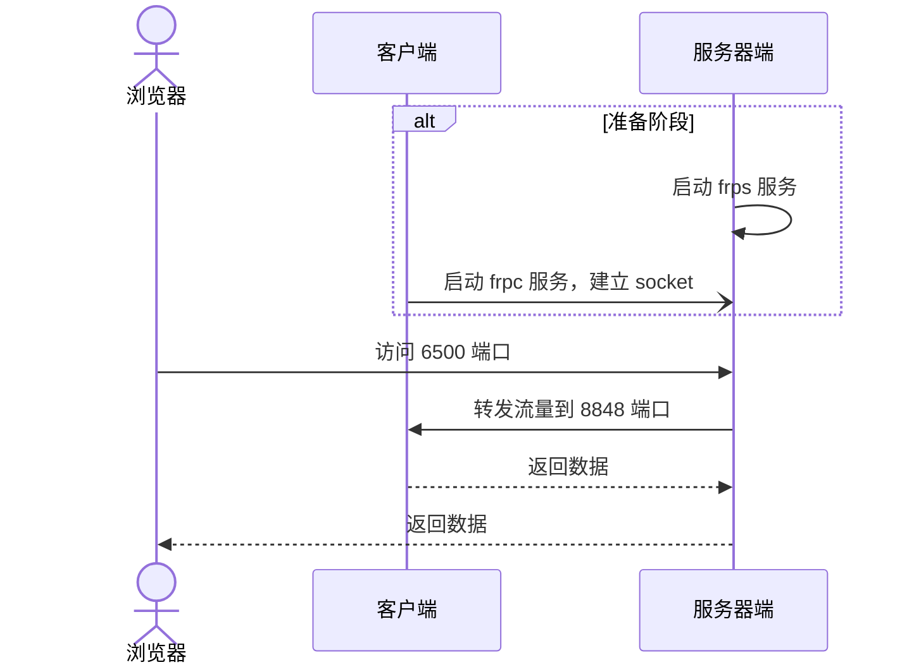

# 搭建内网穿透代理
## 概述
&emsp;&emsp;在开发阶段，为了方便开发，我们有时需要像以下搭建开发环境。


&emsp;&emsp;正常情况下，上述的开发环境都是能满足工作需求的。但是如果远程办公时，那么这个开发环境就出现问题了。远程办公时，研发人员的个人电脑是通过 VPN 的方式连接，此时服务器就无法将请求转发到研发人员的个人电脑了（VPN 播号时，VPN 会给外部设备分配虚拟 IP，内部网络是不能直接访问这个虚拟 IP 的）。为了解决这个问题，则需要使用内网穿透，此时的开发环境如下图:


&emsp;&emsp;研发人员的个人电脑通过和代理建立了一条 Socket，因此代理就可以将流量转发给员工的个人电脑了。市面上目前可以使用公网的 ngrok 代理服务[[链接](https://ngrok.com)]，也可以自己搭建一个内网穿透代理。这里选用 frp 代理（主要是 ngrok 2.0 之后就闭源了，1.x 已经不维护了，源代码编译都困难）。

## 环境
### 服务端运行环境
- CentOS7（x86_64）
### 客户端运行环境
- macOS （x86_64）
### 下载相关包
&emsp;&emsp;下载 frp 程序包。可以在 GitHub 的 Release [[链接](https://github.com/fatedier/frp/releases)]中下载到最新版本的客户端和服务端二进制文件。比较重要的是以下这 4 个文件：

```
frp
├── frpc        // 客户端程序文件
├── frpc.ini    // 客户端配置文件
│
├── frps        // 服务端程序文件
└── frps.ini    // 服务端配置文件
```

## 搭建服务端环境
### 准备环境
&emsp;&emsp;服务器端在运行程序之前，需要调整一下防火墙的配置，开放一些端口：

```bash
# 开启 7000 端口，客户端与服务器连接时使用此端口
$ firewall-cmd --zone=public --add-port=7000/tcp --permanent
# frp 可视化界面的管理端口
$ firewall-cmd --zone=public --add-port=7500/tcp --permanent
# 开启 6500 端口，用于代理客户端的流量
$ firewall-cmd --zone=public --add-port=6500/tcp --permanent
# 重新加载防火墙
$ firewall-cmd --reload

# 如果不想那么麻烦，也可以直接停掉防火墙（生产环境不建议）
$ systemctl stop firewalld
$ systemctl disable firewalld
```

### 运行服务
&emsp;&emsp;将 `frps`、`frps.ini` 两个文件复制到服务器端。然后修改 frps.ini 的配置如下:

```ini
[common]
# 客户端连接端口
bind_port = 7000
# 启用可视化管理界面
dashboard_port = 7500
```

&emsp;&emsp;接下来使用以下命令启动服务即可：

```bash
$ ./frps -c frps.ini

2022/11/29 22:43:13 [I] [root.go:206] frps uses config file: frps.ini
2022/11/29 22:43:14 [I] [service.go:196] frps tcp listen on 0.0.0.0:7000
2022/11/29 22:43:14 [I] [service.go:297] Dashboard listen on 0.0.0.0:7500
2022/11/29 22:43:14 [I] [root.go:215] frps started successfully
```

## 搭建客户端环境
### 启动客户端
&emsp;&emsp;修改 frpc.ini 文件如下：

```ini
[common]
# 将此值修改为 frps 所运行的服务器
server_addr = 10.10.20.20
# 将值值修改为 frps 监听的连接口端（默认不需要改动）
server_port = 7000

# 添加新的连接，这个 nacos 随便取名，因此可以取一个你觉得好记的名称即可
[nacos]
# 需要代理的协议
type = tcp
# 本地 IP
local_ip = 127.0.0.1
# 需要代理的本地端口
local_port = 8848
# 告诉服务端，将 6500 端口的流量转发到本地的 8848 端口
remote_port = 6500
```

&emsp;&emsp;使用以下命令启动客户端即可：

```bash
$ ./frpc -c frpc.ini

2022/11/29 22:48:21 [I] [service.go:357] [8bcb833a4e96ae41] login to server success, get run id [8bcb833a4e96ae41], server udp port [0]
2022/11/29 22:48:21 [I] [proxy_manager.go:142] [8bcb833a4e96ae41] proxy added: [nacos]
2022/11/29 22:48:21 [I] [control.go:177] [8bcb833a4e96ae41] [nacos] start proxy success
```

## 访问服务
&emsp;&emsp;完成以上步骤之后，客户端和服务器端就建立好一条 socket 了。此时，你只需要在浏览器访问服务器端的 6500 端口，就会发现流量已经转发到本地的 8848 端口上。

&emsp;&emsp;完整的流程图如下：

