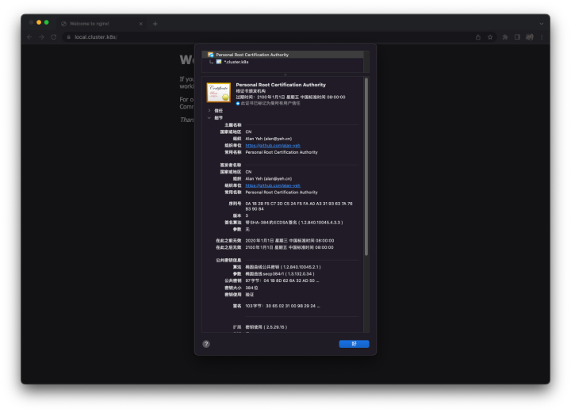
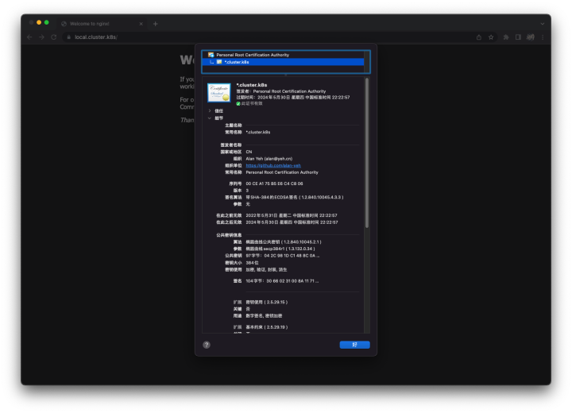

# {{ $frontmatter.title }}
## 概述
&emsp;&emsp;利用 OpenSSL 生成根证书（RootCA），并通过根证书签发新证书。

## 步骤
### 环境准备
- OS： CentOS7

### 生成根证书
&emsp;&emsp;创建 root.cnf 文件，用于保存根证书的相关信息。

```
[ req ]
distinguished_name = req_distinguished_name
x509_extensions = v3_req
prompt = no

[ req_distinguished_name ]
C = CN
O = Alan Yeh (alan@yeh.cn)
OU = https://github.com/alan-yeh
CN = Personal Root Certification Authority

[ v3_req ]
# Extensions to add to a certificate request
keyUsage = critical, keyCertSign, cRLSign
subjectKeyIdentifier = hash
basicConstraints = critical, CA:TRUE
```

&emsp;&emsp;执行以下命令，通过 root.cnf 文件生成根证书。

```bash
# 生成私钥
$ openssl ecparam -out root.key -name secp384r1 -genkey

# 生成证书请求文件
$ openssl req -new -sha384 -key root.key -out root.csr -config root.cnf

# 生成证书
$ openssl x509 -req -extfile root.cnf -extensions v3_req -sha384 -in root.csr -signkey root.key -out root.crt

# 查看证书信息
$ openssl x509 -in root.crt -noout -text
```

### 使用根据书签发域名证书
&emsp;&emsp;创建 cert.cnf 文件，用于保存待签发的证书信息。

```
[ req ]
distinguished_name = req_distinguished_name
x509_extensions = v3_req
prompt = no

[ req_distinguished_name ]
# 签发通用域名证书
CN = *.cluster.k8s

[ v3_req ]
# Extensions to add to a certificate request
authorityKeyIdentifier = keyid
subjectKeyIdentifier = hash
subjectAltName = @alternate_names
keyUsage = digitalSignature, keyEncipherment
extendedKeyUsage = serverAuth, clientAuth
basicConstraints = CA:FALSE

[ alternate_names ]
# 通用域名证书需要设置两个 DNS 信息
# 如果签发单个域名的话，就只需要一个具体的域名信息
DNS.1 = cluster.k8s
DNS.2 = *.cluster.k8s
```

&emsp;&emsp;执行以下命令，通过 cert.cnf 文件生成根证书。

```bash
# 生成私钥
$ openssl ecparam -out cert.key -name secp384r1 -genkey

# 生成请求文件
$ openssl req -new -sha384 -key cert.key -out cert.csr -config cert.cnf

# 使用根证书为域名证书签名
$ openssl x509 -req -extfile cert.cnf -extensions v3_req -in cert.csr -CA root.crt -CAkey root.key -CAcreateserial -out cert.pem -days 730 -sha384
```

## 扩展
&emsp;&emsp;OpenSSL 命令行工具不支持指定证书的生效日期（startdate）和失效日期（enddate），如果有要求证书的生效日期和失效日期必须是指定时间，那么可以通过修改 OpenSSL 的源代码来完成。

&emsp;&emsp;下载 OpenSSL 的源代码[[下载](https://github.com/openssl/openssl/archive/refs/tags/OpenSSL_1_1_1o.zip)]，解压之后，通过 VSCode 打开该源代码目录，全局搜索 `set_cert_times`，然后修改该方法的调用:

```c
// 把第 2 个参数和第 3 个参数写死
// 参数格式是 YYYYMMDDHHMISSZ
set_cert_times(x, "20200101000000Z", "21000101000000Z", days)
```

&emsp;&emsp;修改后保存，然后将源代码复制到服务器（最好搞台虚拟机，千万不要在生产环境上搞）上去编译运行。

```bash
# 安装编译环境
$ yum install -y gcc perl

# 在源代码的根目录下执行以下命令
$ ./config
$ make && make install

# 删除操作系统自带的 OpenSSL
$ rm -rf /usr/bin/openssl
$ rm -rf /usr/include/openssl

# 将新编译好的 OpenSSL 文件部署到系统目录
$ ln -s /usr/local/bin/openssl /usr/bin/openssl
$ ln -s /usr/local/include/openssl/ /usr/include/openssl
$ echo "/usr/local/lib64" >> /etc/ld.so.conf
$ ldconfig -v

# 查看新的 OpenSSL 版本信息
$ openssl version
```

&emsp;&emsp;完成以上步骤后，再执行生成证书的命令，就可以生成指定有效期的证书了。



