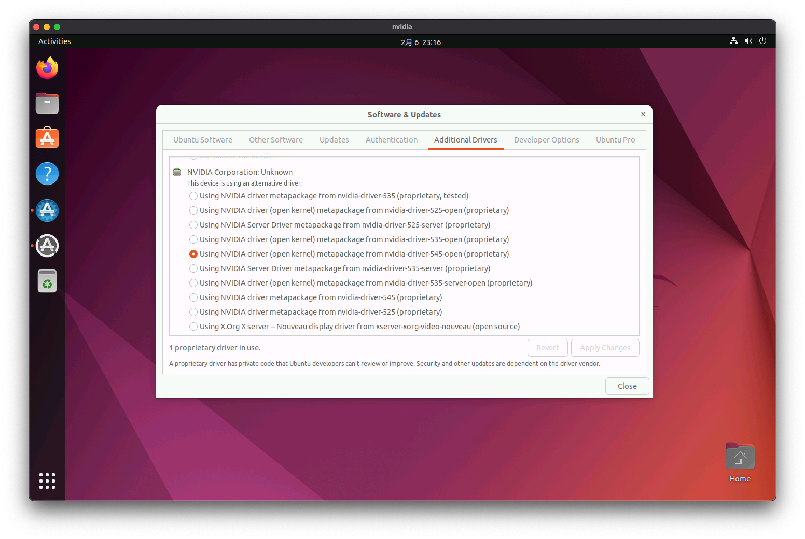

# Nvidia 驱动
## 概述
&emsp;&emsp;本文档主要记录一下在 Ubuntu Desktop 下安装 Nvidia 驱动和 CUDA 的过程。

## 环境

- 操作系统：Ubuntu Desktop 22.04.3
- ESXi: 8.0 Update 2
- 显卡：NVIDIA GeForce RTX 4090

::: danger 提示
&emsp;&emsp;在 ESXi 的虚拟机里安装 Nvidia 驱动，需确保`已关闭`虚拟机配置`引导选项`里的 `启用 UEFI 安全引导`，否则可能会出现正常安装驱动后，但无法找到显卡的问题。详细操作请参考 GPU 直通文档[[链接](/blogs/vmware/esxi/gpu-pass-through)]。
:::

## 操作
### 更新依赖
&emsp;&emsp;打开终端（Terminal），更新系统依赖。

```bash
$ sudo apt update
$ sudo apt upgrade
```
### 安装驱动
#### 可视化安装
&emsp;&emsp;打开 `Software & Updates`，选择 `Additional Drivers` 选项卡，选择 `Using NVIDIA driver (open kernel) metapackage from nvidia-driver-545-open (proprietary)`，点击 `Apply` 完成驱动的安装。



&emsp;&emsp;驱动安装完毕后需重启系统。

#### 命令行安装
&emsp;&emsp;Ubuntu 提供了驱动管理命令：

```bash
# 获取可安装的驱动列表
$ ubuntu-drivers list
open-vm-tools-desktop
nvidia-driver-545, (kernel modules provided by nvidia-dkms-545)
nvidia-driver-535-server-open, (kernel modules provided by linux-modules-nvidia-535-server-open-generic-hwe-22.04)
nvidia-driver-525-server, (kernel modules provided by linux-modules-nvidia-525-server-generic-hwe-22.04)
nvidia-driver-545-open, (kernel modules provided by nvidia-dkms-545-open)
nvidia-driver-535, (kernel modules provided by linux-modules-nvidia-535-generic-hwe-22.04)
nvidia-driver-525, (kernel modules provided by linux-modules-nvidia-525-generic-hwe-22.04)
nvidia-driver-535-server, (kernel modules provided by linux-modules-nvidia-535-server-generic-hwe-22.04)
nvidia-driver-525-open, (kernel modules provided by linux-modules-nvidia-525-open-generic-hwe-22.04)
nvidia-driver-535-open, (kernel modules provided by linux-modules-nvidia-535-open-generic-hwe-22.04)

# 安装驱动
$ sudo apt install nvidia-driver-545-open
```

#### 验证
&emsp;&emsp;重启后，打开终端（Terminal），输入 `nvidia-smi` 验证驱动是否正常安装。

```bash
$ nvidia-smi
Tue Feb  6 22:50:54 2024       
+---------------------------------------------------------------------------------------+
| NVIDIA-SMI 545.29.06              Driver Version: 545.29.06    CUDA Version: 12.3     |
|-----------------------------------------+----------------------+----------------------+
| GPU  Name                 Persistence-M | Bus-Id        Disp.A | Volatile Uncorr. ECC |
| Fan  Temp   Perf          Pwr:Usage/Cap |         Memory-Usage | GPU-Util  Compute M. |
|                                         |                      |               MIG M. |
|=========================================+======================+======================|
|   0  NVIDIA GeForce RTX 4090        Off | 00000000:03:00.0 Off |                  Off |
| 35%   29C    P8               7W / 450W |     19MiB / 24564MiB |      0%      Default |
|                                         |                      |                  N/A |
+-----------------------------------------+----------------------+----------------------+
                                                                                         
+---------------------------------------------------------------------------------------+
| Processes:                                                                            |
|  GPU   GI   CI        PID   Type   Process name                            GPU Memory |
|        ID   ID                                                             Usage      |
|=======================================================================================|
|    0   N/A  N/A      1588      G   /usr/lib/xorg/Xorg                            4MiB |
+---------------------------------------------------------------------------------------+
```

### 安装 CUDA
#### 安装
&emsp;&emsp;打开 Nvidia 官方 CUDA 下载页面[[链接](https://developer.nvidia.com/cuda-toolkit-archive)]，找到待安装的 `CUDA Toolkit` 版本，这里选择 `12.3.2`。进去下载页面后，依次选择 `Linux`、`x86_64`、`Ubuntu`、`22.04`、`runfile (local)`，下载安装包：

```bash
# 下载安装包
$ wget https://developer.download.nvidia.com/compute/cuda/12.3.2/local_installers/cuda_12.3.2_545.23.08_linux.run

# 安装
# 因为我们已经安装过驱动了，因此这里不要勾选安装驱动，只安装 CUDA
$ sudo sh ./cuda_12.3.2_545.23.08_linux.run
┌─ttttttttttttttttttttttttttttttttttttttttttttttttttttttttttttttttttttttttttttt┐
│ CUDA Installer                                                               │
│ - [ ] Driver                                                                 │
│      [ ] 545.23.08                                                           │
│ + [X] CUDA Toolkit 12.3                                                      │
│   [X] CUDA Demo Suite 12.3                                                   │
│   [X] CUDA Documentation 12.3                                                │
│ - [ ] Kernel Objects                                                         │
│      [ ] nvidia-fs                                                           │
│   Options                                                                    │
│   Install                                                                    │
│                                                                              │
│ Up/Down: Move | Left/Right: Expand | 'Enter': Select | 'A': Advanced options │
└─ttttttttttttttttttttttttttttttttttttttttttttttttttttttttttttttttttttttttttttt┘

===========
= Summary =
===========

Driver:   Not Selected
Toolkit:  Installed in /usr/local/cuda-12.3/

Please make sure that
 -   PATH includes /usr/local/cuda-12.3/bin
 -   LD_LIBRARY_PATH includes /usr/local/cuda-12.3/lib64, or, add /usr/local/cuda-12.3/lib64 to /etc/ld.so.conf and run ldconfig as root

To uninstall the CUDA Toolkit, run cuda-uninstaller in /usr/local/cuda-12.3/bin
***WARNING: Incomplete installation! This installation did not install the CUDA Driver. A driver of version at least 545.00 is required for CUDA 12.3 functionality to work.
To install the driver using this installer, run the following command, replacing <CudaInstaller> with the name of this run file:
    sudo <CudaInstaller>.run --silent --driver

Logfile is /var/log/cuda-installer.log

# 设置环境变量
# 在最后的地方加入以下环境变量
$ nano ~/.bashrc
export CUDA_HOME=/usr/local/cuda-12.3/
export PATH=$CUDA_HOME/bin:$PATH
export LD_LIBRARY_PATH=$CUDA_HOME/lib64

# 应用环境变量
$ source ~/.bashrc
```

#### 验证
&emsp;&emsp;完成以上步骤后，输入 `nvcc --version` 验证 CUDA 是否正常安装。

```bash
$ nvcc --version
nvcc: NVIDIA (R) Cuda compiler driver
Copyright (c) 2005-2023 NVIDIA Corporation
Built on Wed_Nov_22_10:17:15_PST_2023
Cuda compilation tools, release 12.3, V12.3.107
Build cuda_12.3.r12.3/compiler.33567101_0
```