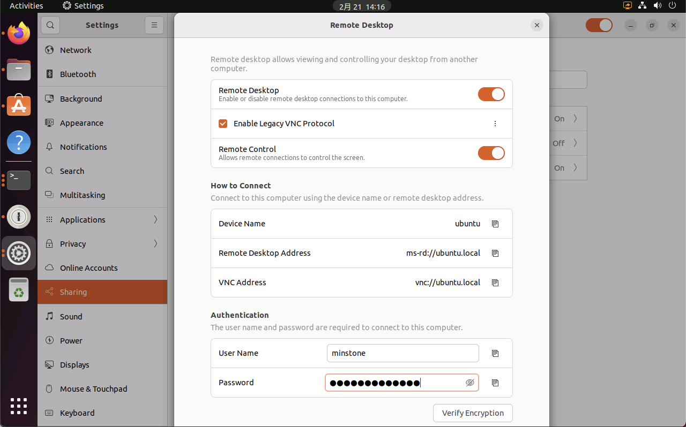
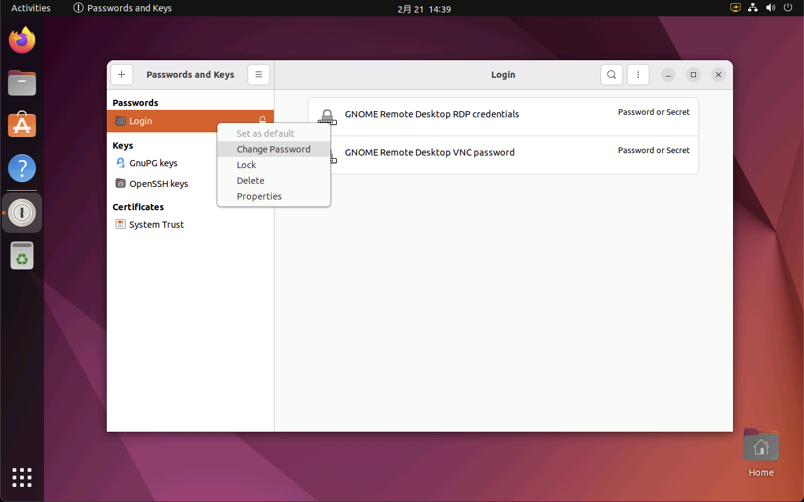
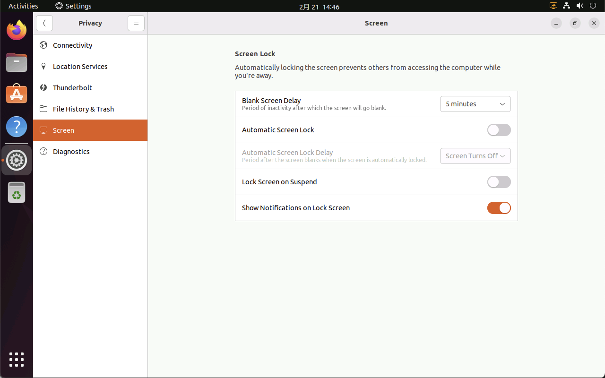
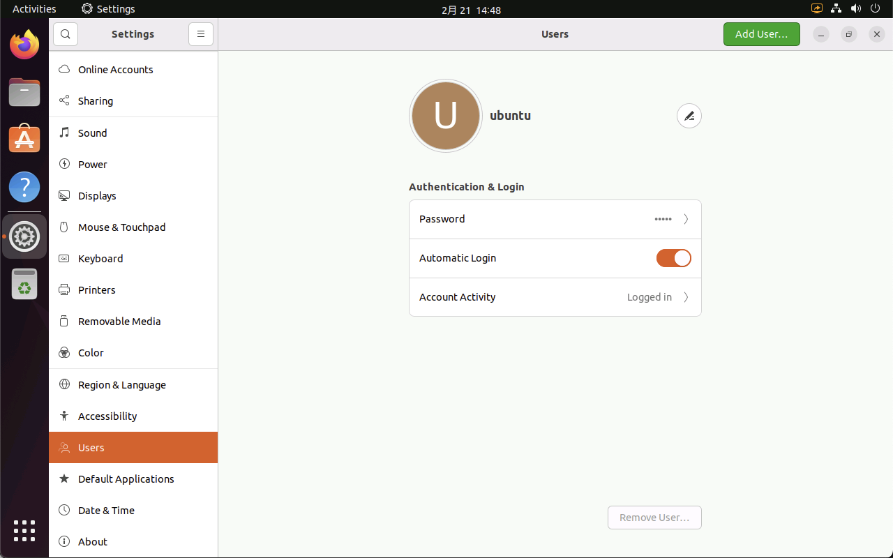

# 远程桌面
## 概述
&emsp;&emsp;Ubuntu Desktop 一般自带有 VNC 远程服务，可以通过简单的操作开启相关功能即可。但是在最新版本下，远程桌面存在一些问题，因此这里记录一下相关问题的解决过程。

## 环境

操作系统：Ubuntu 22.04

## 启用远程桌面
&emsp;&emsp;打开 Settings，找到 Sharing，点击 Remote Desktop，完成以下配置。



&emsp;&emsp;设置时，注意以下几点：

- `Enable Leacy VNC Protocol`：勾选，同时展开选项，选择 `Require a password`，即使用密码登录远程桌面。
- `Authentication`：填写远程桌面使用的密码。该密码可以与本地用户密码不一样。

&emsp;&emsp;完成以上设置后，即可通过 Windows 自带的远程桌面客户端，或使用 VNC Viewer 之类的远程桌面客户端访问 Ubuntu 的远程桌面。

## 问题处理
### 系统重启后无法远程桌面
&emsp;&emsp;Ubuntu 使用 `Keyring` 来将远程桌面的密码保存到本地，系统重启后，Keyring 没有解锁，因此远程桌面无法读取正常的密码，于是就自动生成了一个随机密码，最终导致远程桌面的密码失效了。

&emsp;&emsp;为了解决这个问题，可以将 Keyring 的密码取消即可。在命令行输入 `seahorse`，或在开始菜单里的 `Utilities` 文件夹中找到 `Passwords and Keys` 应用并打开。

&emsp;&emsp;右击 `Passwords` 下的 `Login` 项目，选择 `Change Password`，输入旧密码（一般是用户的登录密码），新密码不输入直接选择 `Continue`，此时应用会提示 `Store passwords unencrypted?` 警告，选 `Continue` 即可清除 Keyring 的密码。



### 系统锁屏后远法远程桌面
&emsp;&emsp;Ubuntu 认为系统锁屏后，无人值守时远程桌面是不安全的，因此会自动关闭远程桌面。解决该问题有以下几个步骤：

- **取消自动锁屏**

&emsp;&emsp;打开 `Settings` ，找到 `Privacy`，进入 `Screen` 选项，将 `Automatic Screen lock` 功能关闭。同时也将 `Lock Screen on Suspend` 关闭。



- **启用自动登录**

&emsp;&emsp;系统重启后，自动登录到系统，这样就可以跳过系统锁屏。



- **使用命令解锁屏幕**

&emsp;&emsp;如果系统意外被锁屏了，也可以通过 ssh 远程到系统，通过命令解锁屏幕。解锁后就可以正常使用远程桌面了。

```bash
# 输入以下命令解锁屏幕，需要输入系统登录密码
$ loginctl unlock-sessions
==== AUTHENTICATING FOR org.freedesktop.login1.lock-sessions ===
Authentication is required to lock or unlock active sessions.
Authenticating as: ubuntu,,, (ubuntu)
Password: 
==== AUTHENTICATION COMPLETE ===
```

- **安装插件**

&emsp;&emsp;除了以上方法，还可以安装 GNOME 的 `Allow Locked Remote Desktop` 插件[[链接](https://extensions.gnome.org/extension/4338/allow-locked-remote-desktop/)]，参考 YouTube 操作视频[[链接](https://www.youtube.com/watch?v=63uppKZ_Alk)]