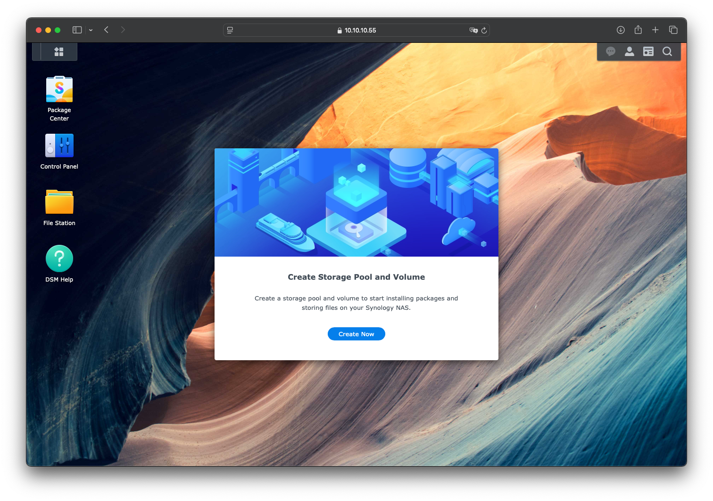
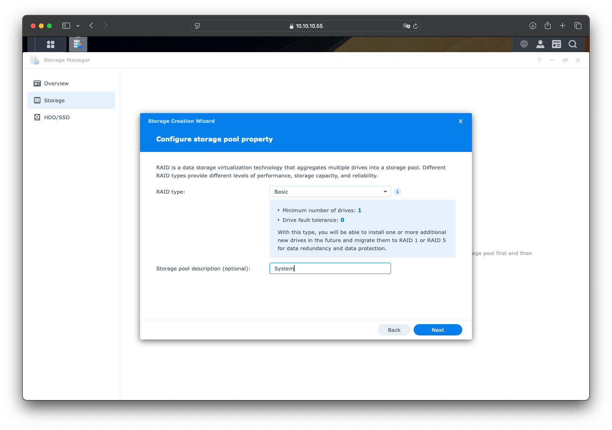
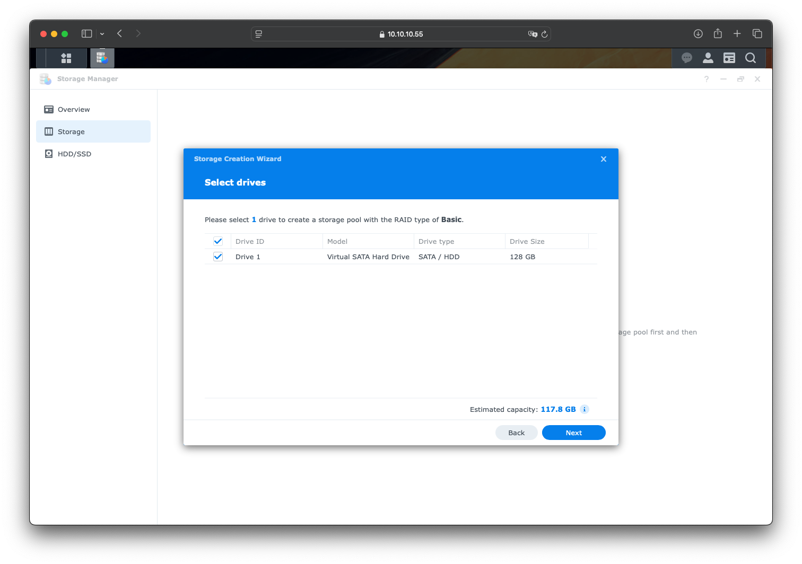
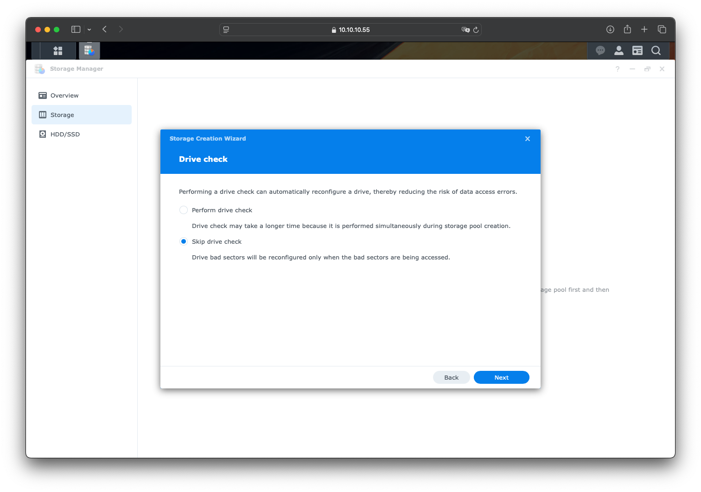
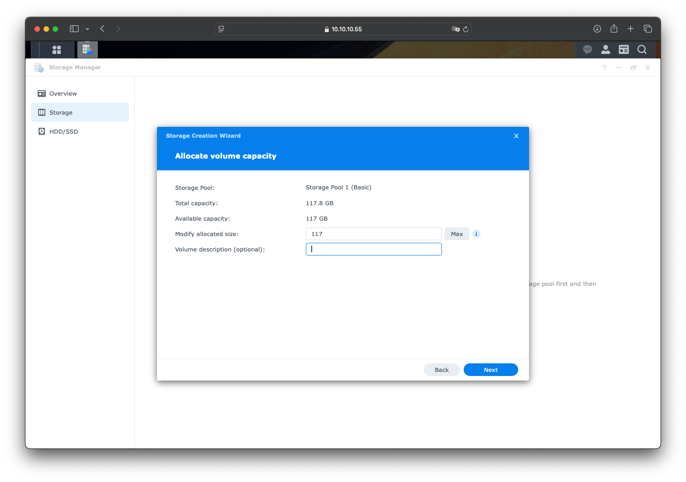
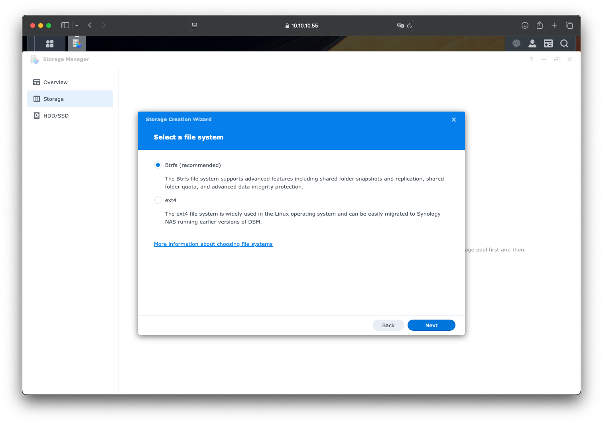
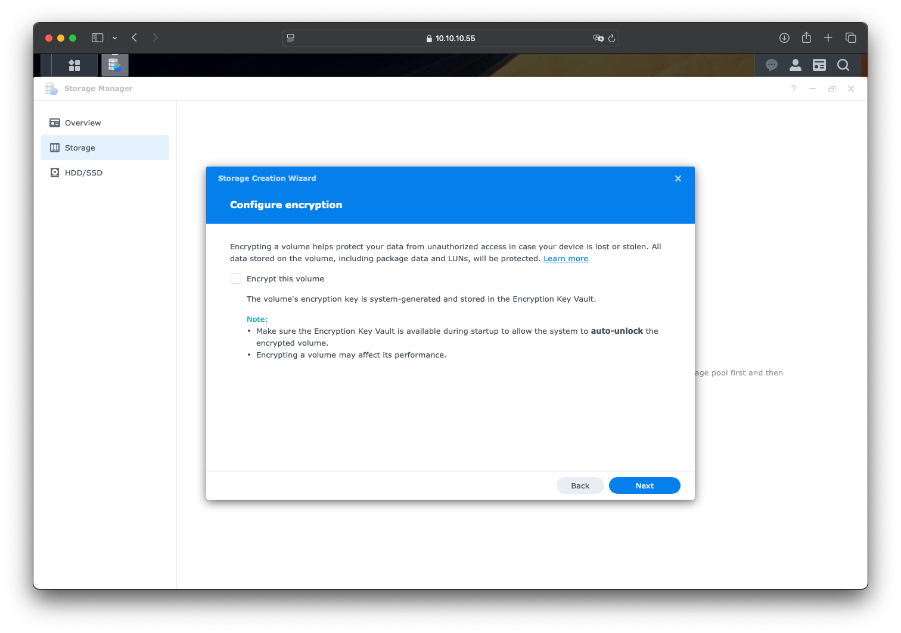
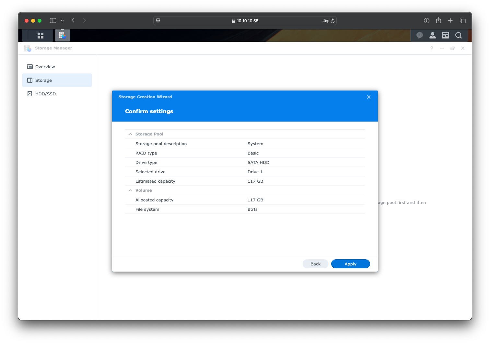
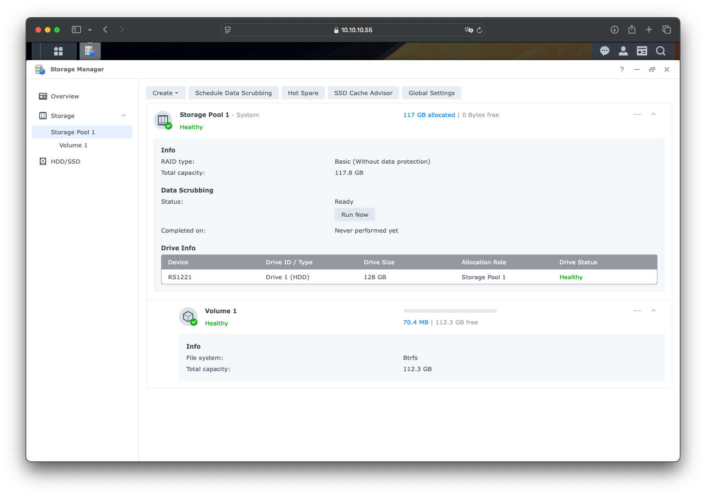

# 存储管理
## 概述
&emsp;&emsp;本文档主要记录如何管理存储池和存储空间。

## 环境

- DSM 7.2.2-72806 Update 2

## 步骤
### 创建存储池和存储空间
&emsp;&emsp;在安装完系统后，系统会自动弹出创建存储池的存储空间的界面。如果关闭了该界面，也可以从存储管理器（Storage Manager）打开此界面。

&emsp;&emsp;在新建存储的引导中，我们需要先初始化第一块硬盘。这里 RAID 类型选择 Basic，还可以为存储池取一个名字，方便后续管理。

::: tip 提示
&emsp;&emsp;RAID 类型可以根据自己的需要选择，有 SHR、Basic、JOB、RAID0、RAID1、RAID5 等，更多信息可以参考另一篇文档[[链接](/blogs/linux/storage/raid)]。
:::

&emsp;&emsp;选择要初始化的硬盘

&emsp;&emsp;跳过硬盘检测，如果是旧盘的话，也可以检测一下硬盘情况。

&emsp;&emsp;创建存储空间，设置为硬盘的最大容量。这一步和电脑的分区意思差不多。在 NAS 里，一般存储池只会创建一个存储空间，通过设置共享文件夹的方式来管理数据。

&emsp;&emsp;选择文件系统，一般选择 `Btrfs` 即可。

&emsp;&emsp;根据实际情况，选择是否加密存储空间

&emsp;&emsp;确认配置信息

&emsp;&emsp;完成。Enjoy！

