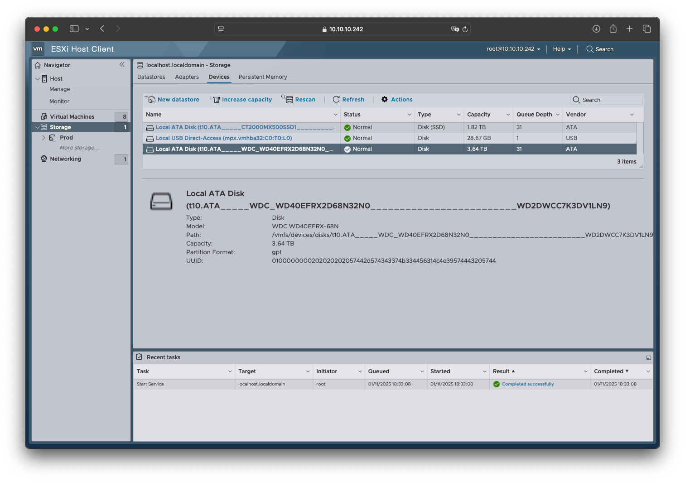
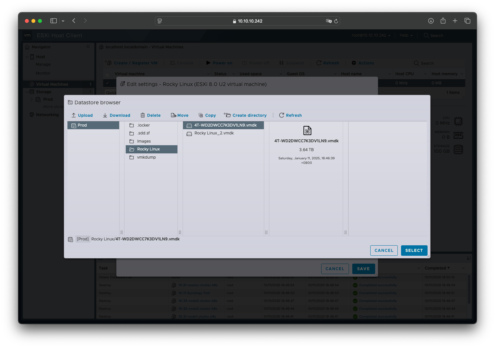
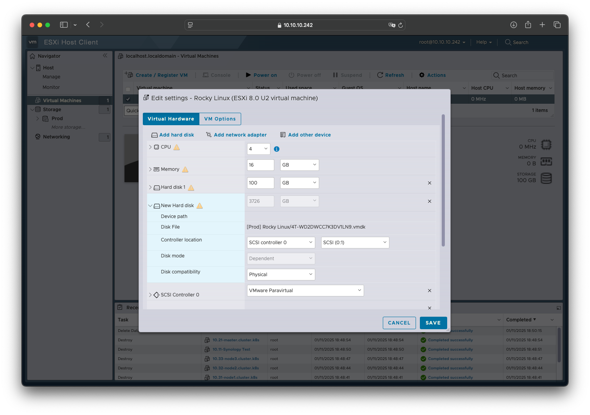

# 硬盘直通
## 概述
&emsp;&emsp;硬盘直通是指将到物理机中的硬盘直接映射上虚拟机，从而实现虚拟机中的硬盘与物理机上的硬盘直接通信。

&emsp;&emsp;本文档主要介绍如何将硬盘直通给虚拟机使用。

## 环境

- ESXi: 8.0 Update 3
- 操作系统: Rocky 9.4

## 操作步骤
### 启用 SSH
&emsp;&emsp;参考另一篇文档启用 SSH [[链接](/blogs/vmware/esxi/enable-ssh)]，然后使用 SSH 登录 ESXi。

```bash
$ ssh root@10.10.10.242
```

### 获取硬件信息
&emsp;&emsp;回到 ESXi 管理界面，在 `Storage` -> `Devices` 页面中，找到待直通的硬件，找到这个硬盘的路径信息：



### 创建直通文件
&emsp;&emsp;使用以下命令创建硬盘直通文件：

```bash
# vmkfstools -z <device-path> <vmdk-path>
$ vmkfstools -z /vmfs/devices/disks/t10.ATA_____WDC_WD40EFRX2D68N32N0_________________________WD2DWCC7K3DV1LN9 /vmfs/volumes/62dde262-92cbd89a-26ea-b47af13738aa/Rocky\ Linux/4T-WD2DWCC7K3DV1LN9.vmdk
```

### 更新虚拟机配置
&emsp;&emsp;打开虚拟机配置界面，添加现有硬盘（Existing hard disk），选择刚才创建的虚拟机印射文件。



&emsp;&emsp;可以看到已识别到刚才新添加的硬盘信息。保存后，打开虚拟机即可访问该硬盘。

