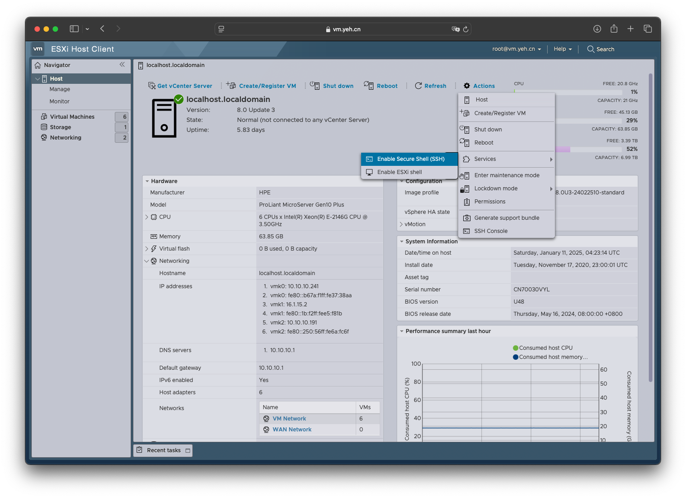

# 启用 SSH
## 概述
&emsp;&emsp;在维护 ESXi 时，经常需要使用 ssh 登录到 ESXi。由于安全问题，ESXi 默认关闭该功能，需要手动启用。

&emsp;&emsp;本文主要介绍如何启用并登录 SSH。

## 环境

- ESXi: 8.0 Update 3

## 操作步骤
### 启用 SSH
&emsp;&emsp;登录到 ESXi 的管理后台后，在 `Action` 菜单下的 `Services` 选项中，点击 `Enable Secure Shell(SSH)` 启用 SSH。



### 登录 SSH
&emsp;&emsp;完成以上步骤后，打开 `Terminal`，使用 ssh 以 `root` 身份访问 ESXi 即可。

```bash
$ ssh root@vm.yeh.cn
(root@vm.yeh.cn) Password: 
The time and date of this login have been sent to the system logs.

WARNING:
   All commands run on the ESXi shell are logged and may be included in
   support bundles. Do not provide passwords directly on the command line.
   Most tools can prompt for secrets or accept them from standard input.

VMware offers powerful and supported automation tools. Please
see https://developer.vmware.com for details.

The ESXi Shell can be disabled by an administrative user. See the
vSphere Security documentation for more information.
[root@localhost:~] 
```