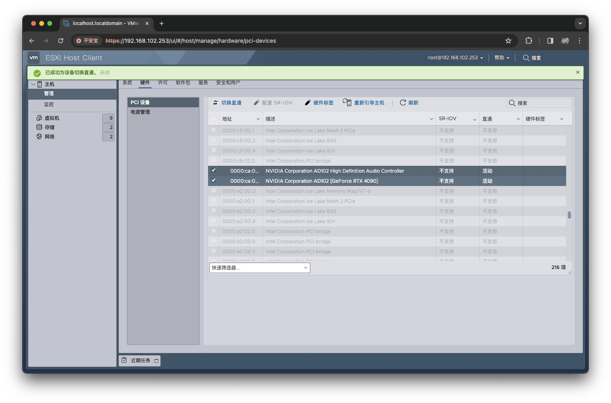
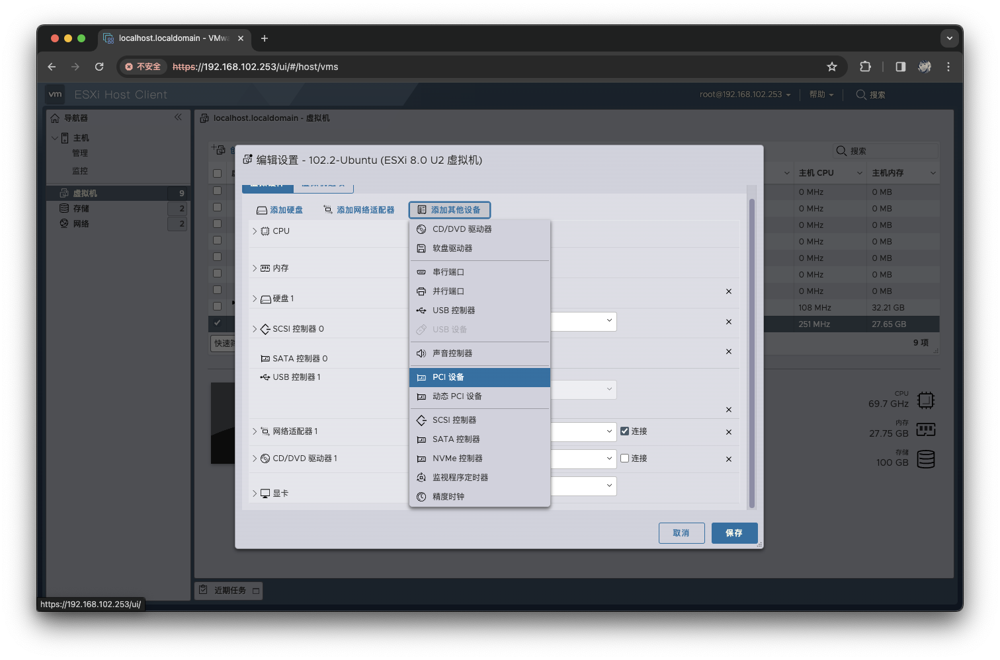
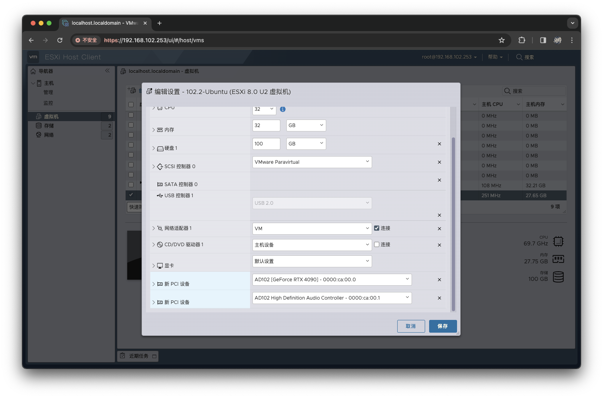
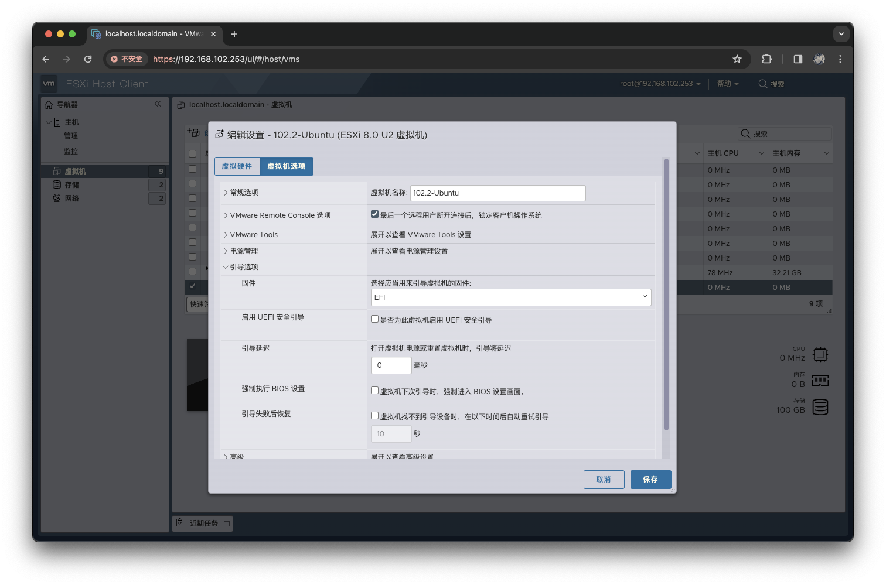

# GUP 直通
## 概述
&emsp;&emsp;在 ESXi 中使用显卡有两种方式，一种方式是通过显卡虚拟化（例如 NVIDIA vGPU）分配显卡资源，另一种是将显卡直通到一台虚拟机中使用。前者一般需要专业显卡才能支持，并且需要购买对应的许可证，而后者只能一个虚拟机独占显卡、对许可证无要求、专业卡或游戏卡均可使用。

&emsp;&emsp;本文中主介绍如何将显卡直通给虚拟机使用。

## 环境

- ESXi: 8.0 Update 2
- 显卡：NVIDIA GeForce RTX 4090
- 操作系统：Ubuntu 22.04.3

## 操作步骤
### 配置 PCI 设备直通
&emsp;&emsp;登录 ESXi 管理界面，在右侧`导航器`的`管理`标签中，找到`硬件`选项卡，选中待直通的 GPU，点击`切换直通`。完成后，可以看到`直通`状态由原来的`禁用`变为`活动`。

### 配置虚拟机
&emsp;&emsp;在右侧`导航器`的`虚拟机`标签中，找到待配置的虚拟机。关闭该虚拟机后，右键点击`编辑设置`，依次点击`添加其它设备`、`PCI`设备。

&emsp;&emsp;在新增加的 PCI 设备中，选择待添加的显卡。

### 修改引导选项
&emsp;&emsp;如果你的虚拟机是 Linux 系统，那么在完成以上配置之后，需要切换到`虚拟机选项`选项卡，将`引导选项`里的`启用 UEFI 安全引导`选项关闭。

### 安装驱动
&emsp;&emsp;完成以上操作后，保存已修改的配置，开机即可。Windows 下只需要到显卡对应的网站下载并安装相关驱动即可正常使用。

&emsp;&emsp;关于在 Linux 下安装 NVIDIA 显卡驱动请参考以下文档：

- Ubuntu [[链接](/blogs/linux/debian/nvidia-driver)]
- CentOS [[链接](/blogs/linux/redhat/nvidia-driver)]