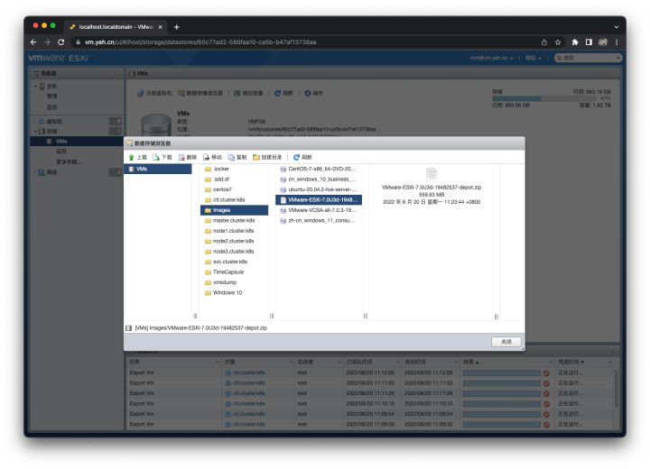
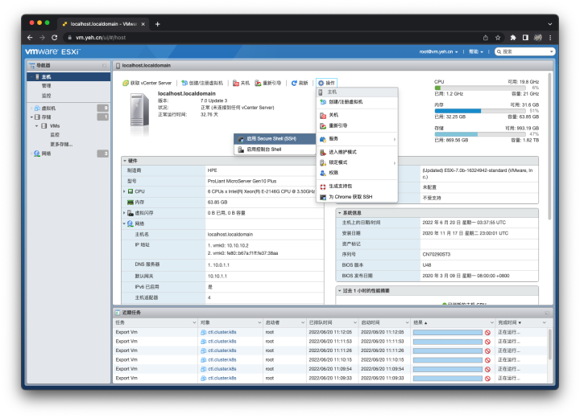

# 使用命令升级 ESXi
## 概述
&emsp;&emsp;在使用 ESXi 的过程中，如果官方发布了新版本的补丁功能，可以通过以下方式升级 ESXi 的版本。

## 操作步骤
### 下载安装包
&emsp;&emsp;在 VMWare 官网[[链接](https://customerconnect.vmware.com/cn/group/vmware/evalcenter?p=free-esxi8)]下载 ESXi 的软件包。注意，升级时，应该下载 Offline Bundle 格式（也就是 zip 格式）的软件包。

&emsp;&emsp;下载完成之后，将该软件包上传到 ESXi 的存储里，如下图所示。



### 远程登录到服务器
&emsp;&emsp;在默认情况下，ESXi 是不允许使用 SSH 远程登录到服务器的，因此需要先启用 Secure Shell。在首面中执行以下操作，即可启用远程 SSH 远程登录功能。



&emsp;&emsp;然后在命令行工具里，就可以执行远程操作了。

```bash
# 远程登录到 ESXi 服务器
$ ssh root@vm.yeh.cn
```

### 执行升级操作

```bash
# 获取当前 ESXi 的版本信息
$ vmware -vl
VMware ESXi 8.0.1 build-21813344
VMware ESXi 8.0 Update 1

# 获取升级包里的版本信息
$ esxcli software sources profile list -d /vmfs/volumes/64872291-989989bc-5cdb-b47af13738aa/Images/VMware-ESXi-8.0U2-22380479-depot.zip 
Name                          Vendor        Acceptance Level  Creation Time        Modification Time
----------------------------  ------------  ----------------  -------------------  -----------------
ESXi-8.0U2-22380479-standard  VMware, Inc.  PartnerSupported  2023-09-21T00:00:00  2023-09-21T00:00:00
ESXi-8.0U2-22380479-no-tools  VMware, Inc.  PartnerSupported  2023-09-21T00:00:00  2023-09-04T22:07:43

# 执行升级，-p 后面的参数就是上面命令获取的信息
$ esxcli software profile update -d /vmfs/volumes/64872291-989989bc-5cdb-b47af13738aa/Images/VMware-ESXi-8.0U2-22380479-depot.zip -p ESXi-8.0U2-22380479-standard

# 升级完之后重启即可
$ reboot
```