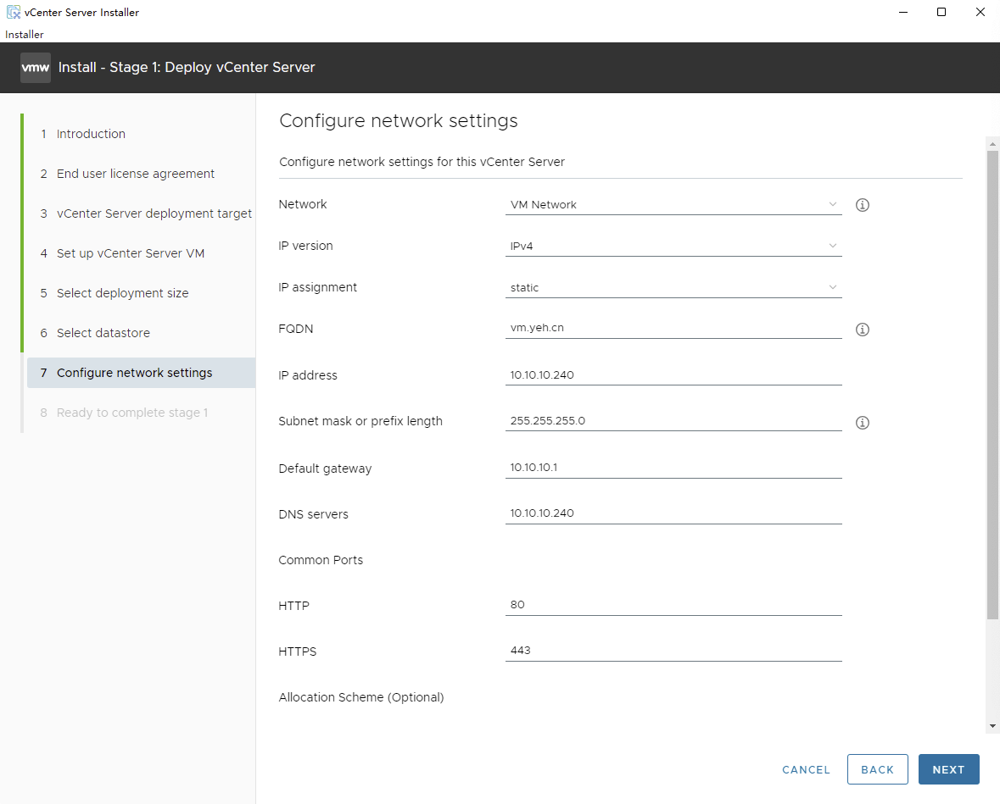
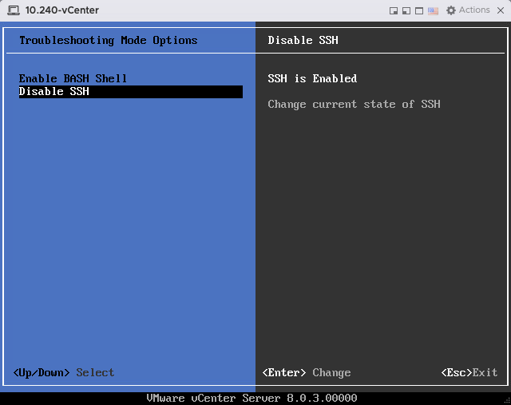

# 无 DNS 环境下安装 vCenter
## 概述
&emsp;&emsp;vCenter 在 7.0U3 之后，必须提供 NDS 环境才能正常工作。而且即使你提供了正常的 DNS 环境，也经常会面临无法启动、卡顿等问题。因此本篇文档记录一下在无 DNS 环境下如何安装 vCenter。

## 步骤
### 第 1 阶段：部署 vCenter Server
&emsp;&emsp;在第 1 阶段部署 vCenter Server 的第 7 步骤，配置网络时，需注意：



- FQDN：如果使用域名访问 vCenter 的话，这里填该 vCenter 的域名，否则填 IP 地址；
- DNS servers：这里直接填 vCenter 的 IP 地址。

&emsp;&emsp;然后继续，完成第 1 阶段的部署工作。

### 修改 vCenter 配置
&emsp;&emsp;完成第 1 阶段的部署工作后，不要点击继续，来到 vCenter 所在的 ESXi，打开 vCenter 的虚拟机控制台，按 F2 并输入密码，在 Troubleshoot Mode Options 中，启用 SSH 服务。



&emsp;&emsp;然后使用 SSH 工具登入 vCenter 后台，切换到 shell 模式，输入以下命令:

```bash
$ sed -i 's#no-hosts#addn-hosts=/etc/dns_add_hosts#g' /etc/dnsmasq.conf

# 添加两行解析
$ echo 10.10.10.240 localhost > /etc/dns_add_hosts
$ echo 10.10.10.240 vm.yeh.cn >> /etc/dns_add_hosts

# 重启服务
$ systemctl restart dnsmasq
```

&emsp;&emsp;接下来可以继续安装程序了。
