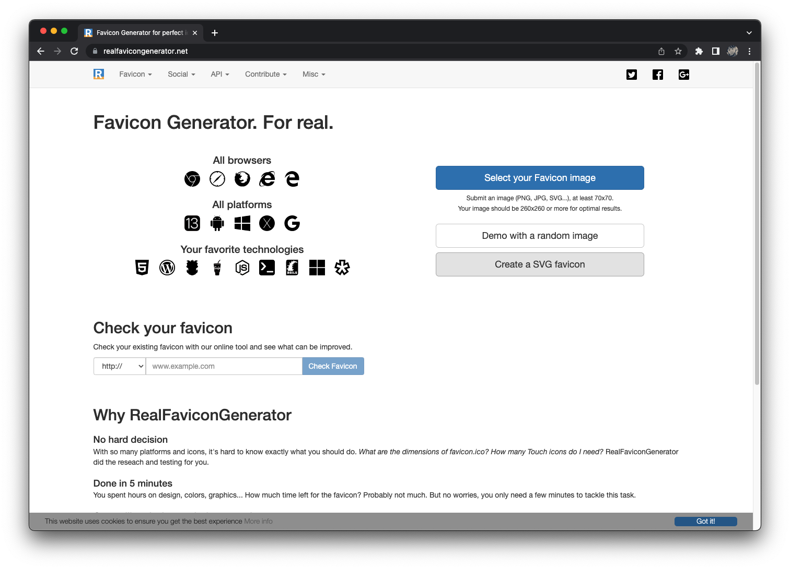
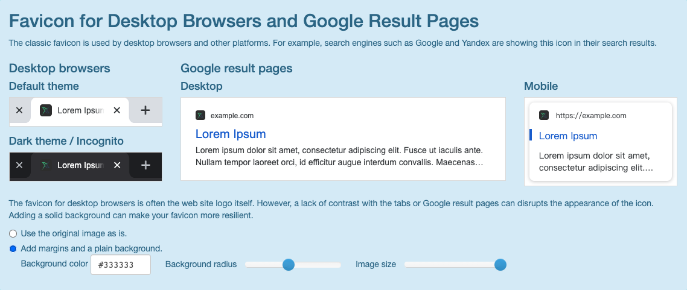
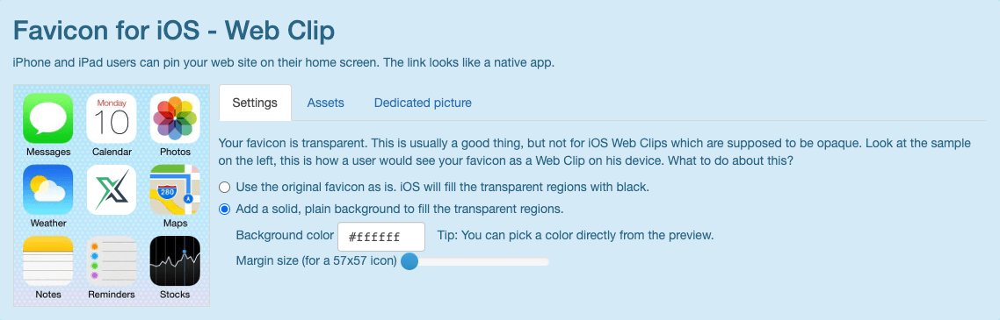
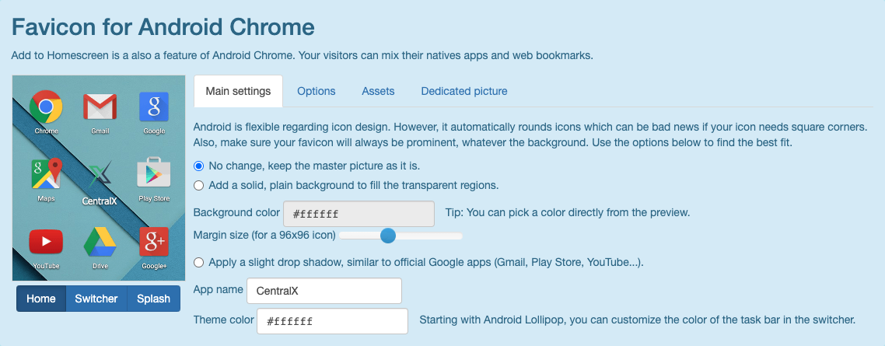
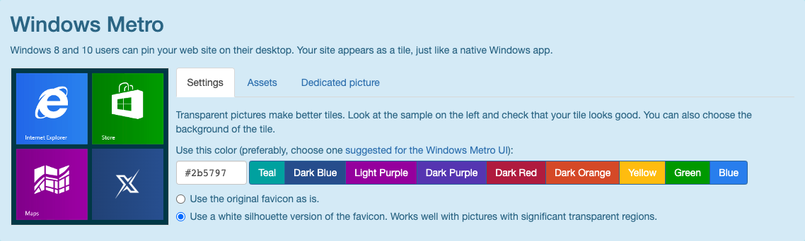
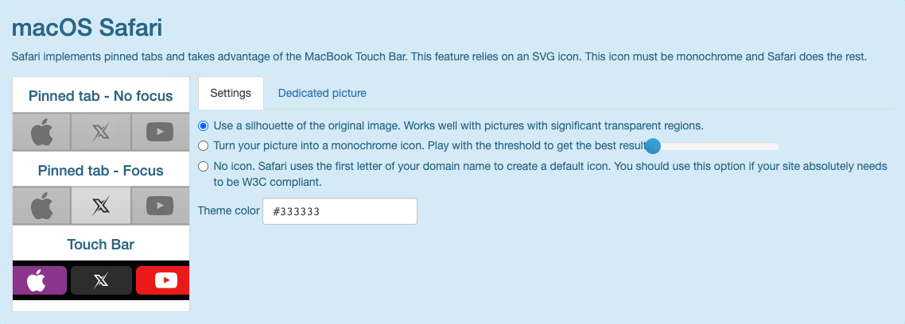
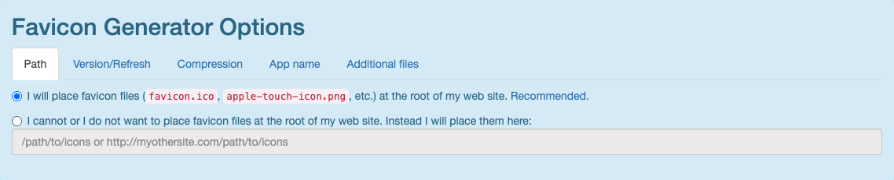
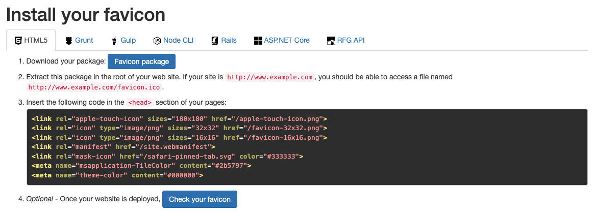
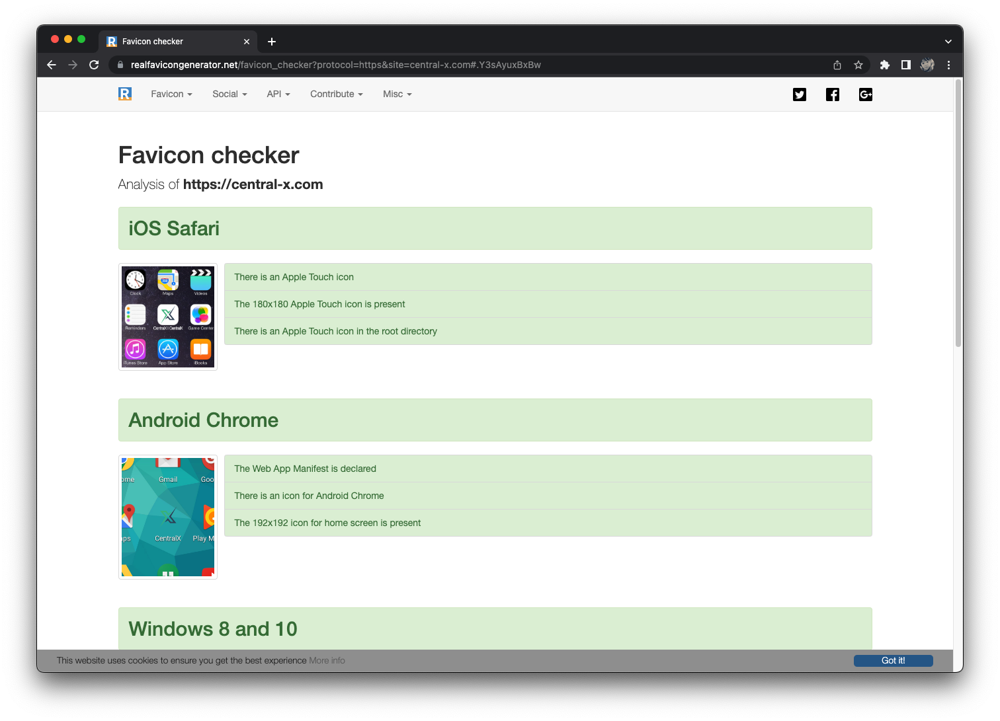

# 快速生成 favicon
## 概述
&emsp;&emsp;favicon 是 Favorites Icon 的缩写，主要用于控制浏览器收藏夹、地址栏和标签标题的个性化图标。这个功能不是必要的，但是可以优化用户体验。

&emsp;&emsp;由于现在客户端的浏览器类型比较多，比如 iOS Safari、macOS Safari、Android 的浏览器、Chrome 浏览器、微软的浏览器等等，每种浏览器为了更好的显示效果，又会要求开发者对其进行适配，因此要做好 favicon 还是有挺多细节要处理的。

&emsp;&emsp;这里推荐一个网站，叫 Favicon Generator. For real.[[链接](https://realfavicongenerator.net)]，这个网站不仅可以生成兼容性良好的 favicon 图标以及相关 html 代码，并且可以支持检测你的网站的 favicon 是否设置得当，还可以预览你的网站在不同端的显示情况，还是蛮不错的网站。

## 使用说明
### 生成 favicon
&emsp;&emsp;打开网站首页[[链接](https://realfavicongenerator.net)]，找到 `Select your Favicon image` 按钮，上传需要制作 favicon 的图标文件。这里有条件的话，建议上传 svg 格式的图片。

&emsp;&emsp;等待一段时间之后，网站就会为你生成所有浏览器的配置信息。在这个页面里，你可以详细配置你的图标在每种场景下的显示方式。

&emsp;&emsp;在 Favicon for Desktop Browsrs and Google Result Pages 选项栏里，主要用于控制你的图标在桌面浏览器的标签页以及在 Google 搜索结果里面的显示的图标样式。你可以通过修改下面的 Background color 输入框来控制图片的背景颜色，通过拖动 Background radius 滚动条来控制这个图标的圆角，通过拖动 Image size 滚动条来控制图片大小。你可以实时预览你的图标的显示效果。调整满意之后处理下一项。

&emsp;&emsp;在 Favicon for iOS - Web Clip 选项栏里，主要用于当 iOS 用户将你的网站保存到桌面上时的图标显示样式。如果你的图片是 PNG 格式，并且带有透明样式的话，图标的背景色变会成黑色，因此你可以通过设置图片的背景色来控制 iOS 系统里的图标样式。同时，你也可以切换到 Dedicated picture 选项卡里面，另外上传一张图片作为你的网站在 iOS 系统里的专用图标。

&emsp;&emsp;在 Favicon for Android Chrome 选项栏里，主要用于控制当 Android 用户将你的网站保存到桌面时的图标显示样式。同时，你也可以切换到 Dedicated picture 选项卡里面，另外上传一张图片作为你的网站在 Android 系统里的专用图标。

&emsp;&emsp;在 Windows Metro 选项栏里，主要用于控制在 Windows 系统用户将你的网站保存到桌面时的图标样式。为了保持样式统一，你可以选择使用白底的图标配上背景色，形成比较标准的 Metro 色块图标。同时，你也可以切换到 Dedicated picture 选项卡里面，另外上传一张图片作为你的网站在 Windows 系统里的专用图标。

&emsp;&emsp;在 macOS Safari 选项栏里，主要用于控制 macOS 用户将你的网站 pin 在标签栏里，或带有 Touch Bar 的 Bacbook 用户的图标样式。你可以控制你的图标的颜色或切换到 Dedicated picture 选项卡里面，另外上传一张图片作为你的网站在 macOS Safari 的专用图标。

&emsp;&emsp;最后，在 Favicon Generator Options 选项栏里，控制 Favicon 图标的生成选项。一般情况下不需要修改这些内容。

&emsp;&emsp;点击 Generate your Favicons and HTML code 按钮，等待片刻，网关会根据你的设置生成相关 favicons 资源文件和 HTML 代码。点击 Favicon package 按钮，即可下载 HTML5 的资源包，将这些资源包放到你的网站根目录下，然后将代码框里的内容贴到你网站页面上的 `<head>` 标签里即可。

### 检查 Favicon 是否设置得当
&emsp;&emsp;回到这个网站的首页[[链接](https://realfavicongenerator.net)]，在 Check your favicon 里面填入你的网站地址，然后点击 Check Favicon 按钮，就可以检测你的网站是否正确设置了。

