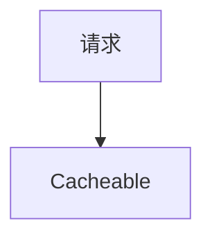

# {{ $frontmatter.title }}
## 概述
&emsp;&emsp;Central Starter Cache 主要用于为项目提供缓存管理功能。在后端开发过程中，经常通过缓存来提升接口响应速度，减少数据库的压力。由于 Spring Cache 的缓存管理功能不支持级联删除功能，因此可能会出现缓存清除困难、缓存清除不干净等问题，很多应用程序不得不提供手动「清除缓存」的功能给用户，用户体验不佳。

::: details 级联删除定义
&emsp;&emsp;级联删除是指：定义 A 缓存依赖 B 缓存，定义 B 缓存依赖 C 缓存；当 C 缓存被删除时，缓存框架应根据依赖关系找到 B 和 A 缓存，然后依次删除。

&emsp;&emsp;缓存级联删除功能可以解决缓存管理复杂等问题。
:::

## Maven 座标
```xml
<dependency>
    <groupId>com.central-x</groupId>
    <artifactId>central-starter-cache</artifactId>
    <version>${centralx.version}</version>
 </dependency>
```

## 使用类库
### 启用缓存功能
&emsp;&emsp;开发者需要在程序启动类或配置类上添加 `@EnableCaching` 注解，用于启用本类库提供的缓存功能。

```java
@EnableCaching
@SpringBootApplication
public class YourApplication {
    public static void main(String[] args) {
        SpringApplication.run(YourApplication.class, args);
    }
}
```

### 注解
#### 执行顺序


