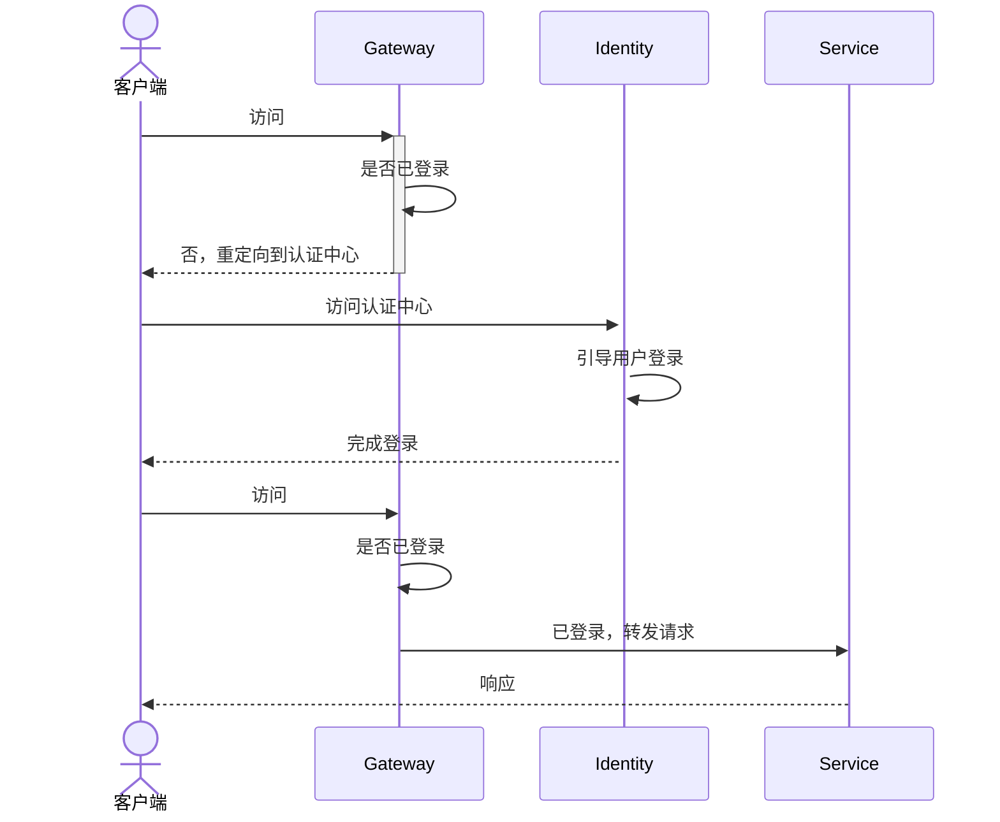

# Central Identity
## 概述
&emsp;&emsp;Central Identity 是 Central Studio 套件中的会话认证管理中心，通过插件可以方便的管理会话认证过程。Central Identity 还实现了多种统一认证协议，可以供第三方应用系统接入进来，包括:

- OAuth2.0 认证协议
- CAS 认证协议
- OpenId 认证协议（实现中）
- SAML 认证协议（实现中）

## 认证流程

