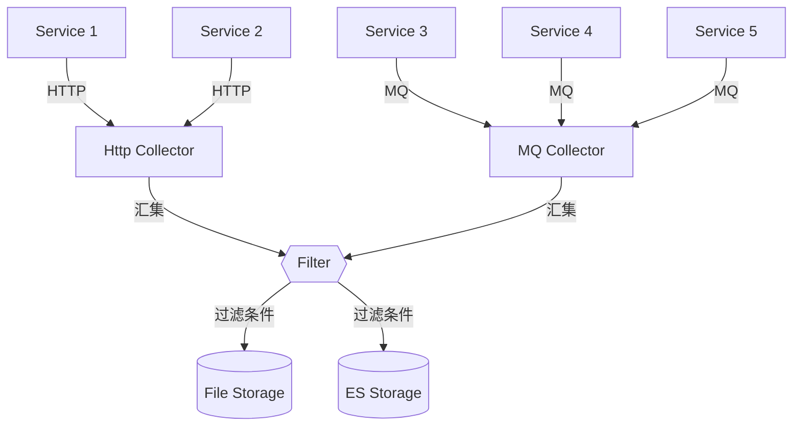

# Central Logging
## 概述
&emsp;&emsp;Central Logging 是 Central Studio 套件中的日志中心，主要用于集中收集和处理所有系统产生的各类日志数据。

&emsp;&emsp;Central Logging 通过采集器（Collector）可以通过多种渠道将日志集回来，然后通过过滤器，将不同的日志进行过滤和筛选，最终将日志保存到指定的容器中。

