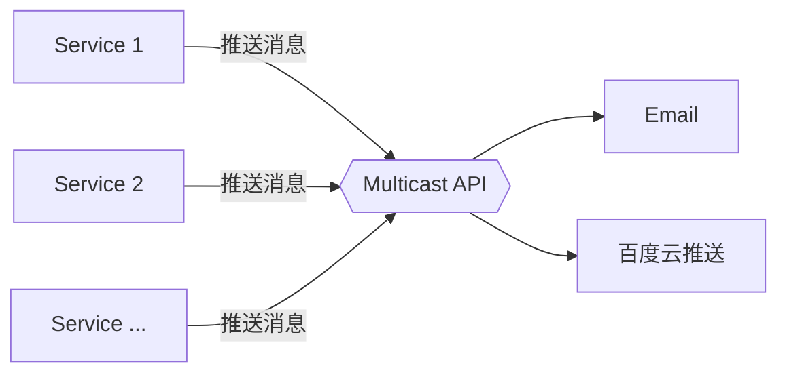

# Central Multicast
## 概述
&emsp;&emsp;Central Multicast 是 Central Studio 套件中的广播中心，主要为应用系统提供统一的消息推送功能。Central Multicast 实现了标准的消息广播接口，可以统一对接到第三方消息中心。

&emsp;&emsp;在标准的广播接口后面，Central Multicast 通过插件系统接入了多种第三方推送系统，包括：

- 邮件推送: 将消息通过邮件的方式推送给指定的用户。
- 百度云推送（Android）: 将将消息通过百度云推送到 Android 应用软件中。(实现中)
- 百度云推送（iOS）: 将将消息通过百度云推送到 iOS 应用软件中。(实现中)

