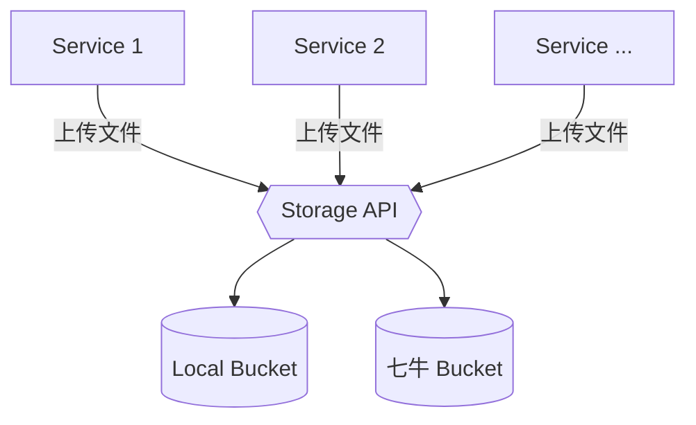

# Central Storage
## 概述
&emsp;&emsp;Central Storage 是 Central Studio 套件中的存储中心，可以为应用系统提供统一的文件存储功能。Central Storage 实现了标准的文件对象存储接口，并提供了分片上传与断点下载功能。

&emsp;&emsp;在标准的文件对象存储接口后面，Central Storage 通过插件系统实现了多种第三方文件存储系统，包括：

- 本地文件存储: 将文件保存到当前本地磁盘
- 七牛: 将文件保存到七牛云 (实现中)

